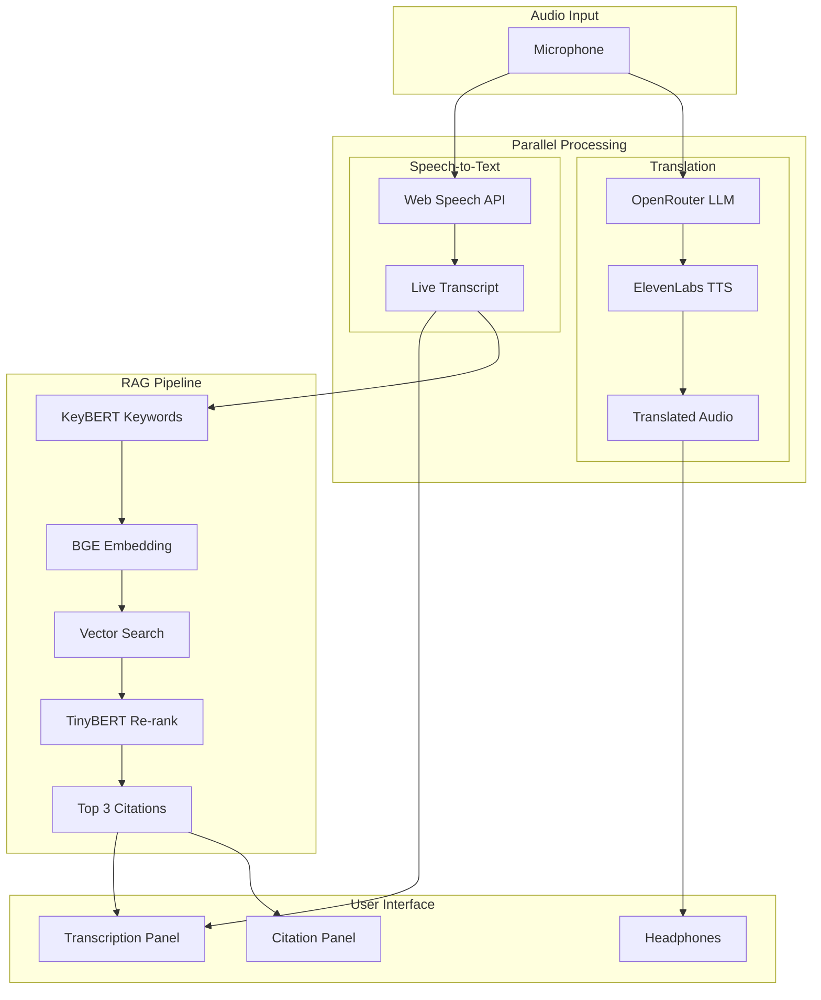
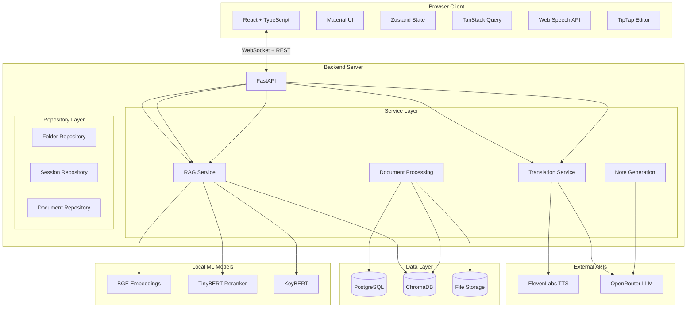

# Rosetta

**Real-time lecture translation and learning assistant**

Rosetta helps international students and language learners break through language barriers in real-time. It provides live lecture translation, automatic transcription, intelligent citations from course materials, and structured note generation.

*"Your voice in every language"*

---

## The Problem

Over 6 million students study abroad annually. Most attend institutions where instruction is delivered in a language that is not their native tongue. These students miss critical content while mentally translating, spend hours post-lecture reconstructing what was said, experience cognitive fatigue that reduces retention, and hesitate to participate due to language anxiety.

Existing solutions fail to address the complete problem. Live human interpreters are expensive and not scalable. Post-lecture transcription offers no real-time benefit. Generic translation apps lack course context and cannot align with learning materials. Recorded lecture translation delays learning and prevents immediate engagement.

Rosetta exists because language should never be a barrier to education.

---

## How It Works

Rosetta operates through three parallel pipelines during live lectures, each optimized for low latency to support real-time use.

### Pipeline Architecture



### Translation Pipeline

The translation pipeline captures audio via the browser's Web Speech API, translates text through OpenRouter using Claude 3 Haiku, and outputs natural speech via ElevenLabs TTS. We chose a text-based approach rather than direct speech-to-speech because it enables us to simultaneously display transcripts, trigger RAG queries, and store segments for note generation from a single audio stream.

The pipeline processes audio in real-time with the professor's speech captured by the browser, transcribed to text, sent to the LLM for translation, and then synthesized into natural-sounding audio in the student's native language. The audio streams directly to the student's headphones with minimal perceptible delay.

### RAG Pipeline

The RAG pipeline continuously analyzes professor speech to surface relevant course materials as in-text citations. Transcript segments accumulate in a sliding window of two to three sentences before triggering a query. This windowing approach balances context richness against latency requirements.

Citations appear inline within the transcription as superscript numbers with varying opacity based on relevance. The most relevant citation appears darkest, providing visual hierarchy without cluttering the interface. Clicking a citation number reveals the corresponding document content in the sidebar panel.

### Note Generation

After the lecture concludes, students can generate comprehensive structured notes that combine the full translated transcript with all citations. The LLM reorganizes content into sections with headings, bullet points, and embedded references. Notes are rendered in a TipTap editor with full editing capabilities and can be exported as PDF.

---

## System Architecture

The system follows a monorepo structure with clear separation between frontend and backend concerns. The architecture prioritizes real-time performance while maintaining clean code organization.



### Frontend Architecture

The frontend is built with React 18 and TypeScript, using Material UI for accessible, styled components. State management is split between Zustand for ephemeral client state like audio controls and UI preferences, and TanStack Query for server state with caching and optimistic updates.

The Web Speech API handles audio capture and browser-native transcription. TipTap provides the rich text editing experience for notes with Markdown support. The entire UI supports dynamic internationalization with all copy stored in a Zustand store containing language-specific translations for six languages.

### Backend Architecture

The backend follows the Controller-Service-Repository pattern with dependency injection for clean separation of concerns and testability.

**Controller Layer:** Handles API endpoint definitions and request/response handling. FastAPI provides automatic OpenAPI documentation and request validation through Pydantic models.

**Service Layer:** Contains business logic and orchestration. Services coordinate between external APIs like ElevenLabs and OpenRouter, local ML models, and repositories. All external API calls use async processing for non-blocking I/O.

**Repository Layer:** Abstracts data access with clean interfaces for PostgreSQL relational data, ChromaDB vector storage, and file system operations for uploaded documents.

### Data Layer

PostgreSQL stores structured data including folders, sessions, transcripts, citations, and notes. The schema supports folder-based organization where each folder contains multiple sessions, and each session contains transcripts, documents, and generated notes.

ChromaDB stores vector embeddings for semantic search. Document chunks are embedded using the BGE model and stored with metadata including document ID, page number, and section heading. The vector database enables fast similarity search during the RAG pipeline.

File storage holds uploaded PDF documents in their original form alongside extracted text chunks.

---

## Technical Implementation

### RAG Pipeline Optimization

The citation pipeline needed to feel instantaneous during live lectures. We achieved significant latency reduction through a series of optimizations focused on moving computation from external APIs to local inference.

**Query Enrichment:** We replaced two sequential LLM API calls for keyword extraction and concept expansion with KeyBERT running locally. KeyBERT uses the sentence-transformers library with the all-MiniLM-L6-v2 model to extract meaningful keywords from transcript windows. This eliminates network round-trip latency entirely for the enrichment stage.

**Embedding Generation:** We switched from OpenAI's text-embedding-3-large model accessed via API to a local BGE model (BAAI/bge-base-en-v1.5). The local model generates 768-dimensional embeddings compared to the 3072-dimensional API embeddings, but we found minimal quality degradation for educational content retrieval while gaining substantially faster inference.

**Re-ranking:** The cross-encoder re-ranker moved from ms-marco-MiniLM-L-6-v2 (a 6-layer model) to ms-marco-TinyBERT-L-2-v2 (a 2-layer model). We also reduced the candidate pool from 10 documents to 5 before re-ranking. TinyBERT provides faster inference with acceptable accuracy for our use case.

**Distance-Based Early Exit:** We implemented a gating mechanism that skips re-ranking entirely when the minimum distance from vector search exceeds a threshold of 1.5. This optimization recognizes that some transcript windows contain no content relevant to uploaded materials, and re-ranking irrelevant results wastes computation.

The key insight: local models running on the same machine as the application provide dramatically faster inference than API calls, even when accounting for model loading overhead. For educational content retrieval where perfect semantic understanding is not required, smaller local models deliver acceptable quality.

### Real-Time Translation

The translation pipeline prioritizes speed while maintaining natural-sounding output. We chose text-based translation over direct speech-to-speech for several reasons.

First, the text intermediate representation enables multiple downstream uses. The same transcript text feeds into the RAG pipeline, appears in the transcription display, and accumulates for note generation. A speech-to-speech approach would require separate processing for each use case.

Second, text translation through an LLM provides better quality for technical content than current speech-to-speech models. Academic lectures contain specialized vocabulary that benefits from the reasoning capabilities of models like Claude 3 Haiku.

Third, the modular approach allows independent optimization of each stage. We can swap TTS providers, upgrade the translation model, or adjust transcription settings without rebuilding the entire pipeline.

ElevenLabs provides the text-to-speech synthesis using the eleven_turbo_v2_5 model, which balances natural-sounding output against generation speed. Voice selection is configurable per session.

### Document Processing

Uploaded PDF documents go through a multi-stage processing pipeline before becoming available for RAG queries.

**Text Extraction:** We extract text from PDFs while preserving page boundaries. Page numbers are stored as metadata so citations can reference specific pages for the user to review.

**Chunking:** Extracted text is split into chunks with configurable size and overlap. Overlap ensures that concepts spanning chunk boundaries are not lost. Each chunk maintains a reference to its source page and document.

**Embedding:** Chunks are embedded using the local BGE model and stored in ChromaDB with full metadata. The embedding process runs asynchronously so users are not blocked while large documents process.

**Metadata Enrichment:** Section headings are extracted where available and stored alongside chunks to provide additional context for retrieval.

### Dynamic Internationalization

The entire UI supports six languages with real-time switching. All user-facing copy lives in a Zustand store with a structured translation object for each supported language. Changing the base language updates every label, button, tooltip, and message instantly without page reload.

The translation keys are organized by feature area and include all static copy plus dynamic patterns for interpolated values like session names and document titles. The language store also handles right-to-left text direction for languages that require it.

---

## Tech Stack

| Layer | Technology | Purpose |
|-------|------------|---------|
| Frontend | React 18, TypeScript | Component-based UI with type safety |
| UI Framework | Material UI (MUI) | Accessible component library with theming |
| Client State | Zustand | Lightweight state management for UI state |
| Server State | TanStack Query | Caching, optimistic updates, background refetching |
| Text Editor | TipTap | Headless rich text editor with Markdown support |
| Backend | FastAPI, Python 3.11 | Async API framework with automatic OpenAPI docs |
| ORM | SQLAlchemy 2.0 | Async database operations with type hints |
| Migrations | Alembic | Database schema versioning |
| Validation | Pydantic | Request/response schema validation |
| Relational DB | PostgreSQL | Sessions, folders, notes, metadata |
| Vector DB | ChromaDB | Document embeddings for semantic search |
| Text-to-Speech | ElevenLabs API | Natural voice synthesis (eleven_turbo_v2_5) |
| Speech-to-Text | Web Speech API | Browser-native transcription |
| LLM | OpenRouter (Claude 3 Haiku) | Translation and note generation |
| Embeddings | BAAI/bge-base-en-v1.5 | 768-dimensional local embeddings |
| Keywords | KeyBERT | Local keyword extraction for query enrichment |
| Re-ranking | TinyBERT Cross-Encoder | Fast candidate re-ranking |
| PDF Export | WeasyPrint | Note export to PDF |
| Infrastructure | Docker, Docker Compose | Containerized PostgreSQL and ChromaDB |

---

## API Design

The backend exposes RESTful endpoints for CRUD operations and WebSocket connections for real-time streaming.

### REST Endpoints

**Folder Management:** Create, read, update, and delete folders for organizing courses. Folders contain sessions and provide the top-level organizational structure.

**Session Management:** Start and end lecture sessions within folders. Sessions track source and target languages, timestamps, and status. Each session accumulates transcripts and citations.

**Document Management:** Upload, list, and delete PDF documents. Documents go through async processing for text extraction and embedding. Status endpoints allow polling for processing completion.

**Notes:** Retrieve and update session notes. A generate endpoint triggers LLM-powered restructuring of transcripts into structured notes. An export endpoint renders notes to PDF.

**RAG:** Query endpoint accepts transcript text and returns ranked citations with document references and relevance scores.

**Question Translation:** Translate student questions from their native language to English for classroom participation.

### WebSocket Endpoints

**Transcription Stream:** Maintains connection for pushing transcription updates as speech is detected. The browser captures audio and sends partial transcripts which the server broadcasts back for UI display.

**Translation Stream:** Manages real-time translation flow. Transcripts arrive, get translated, and TTS audio URLs are pushed back for playback.

---

## Supported Languages

| Code | Language | Translation | TTS | Transcription |
|------|----------|-------------|-----|---------------|
| en | English | Source | Yes | Yes |
| zh | Chinese (Mandarin) | Yes | Yes | Yes |
| hi | Hindi | Yes | Yes | Yes |
| es | Spanish | Yes | Yes | Yes |
| fr | French | Yes | Yes | Yes |
| bn | Bengali | Yes | Yes | Yes |

---

## Project Structure

```
rosetta/
├── frontend/                    # React application
│   ├── src/
│   │   ├── components/          # Shared UI components (Sidebar, Navbar, etc.)
│   │   ├── features/            # Feature modules
│   │   │   ├── home/            # Landing page and folder management
│   │   │   ├── sessions/        # Session page with transcription and translation
│   │   │   ├── notes/           # TipTap editor and note generation
│   │   │   └── documents/       # Document upload and management
│   │   ├── hooks/               # Custom React hooks (useSession, useDocuments, etc.)
│   │   ├── services/            # API client with axios
│   │   ├── stores/              # Zustand stores (language, user settings)
│   │   └── theme/               # Material UI theme configuration
│   ├── icons/                   # SVG icons and logos
│   └── package.json
│
├── backend/                     # FastAPI application
│   ├── app/
│   │   ├── api/                 # Route handlers organized by resource
│   │   │   └── v1/              # Versioned API endpoints
│   │   ├── core/                # Configuration and database setup
│   │   ├── models/              # SQLAlchemy ORM models
│   │   ├── schemas/             # Pydantic request/response DTOs
│   │   ├── services/            # Business logic layer
│   │   │   ├── rag_service.py   # RAG pipeline with KeyBERT, BGE, TinyBERT
│   │   │   ├── translation_service.py
│   │   │   └── note_service.py
│   │   ├── repositories/        # Data access layer
│   │   └── external/            # External API clients (ElevenLabs, OpenRouter)
│   ├── alembic/                 # Database migrations
│   └── requirements.txt
│
├── docker/                      # Docker Compose configuration
│   └── docker-compose.yml       # PostgreSQL and ChromaDB services
│
└── docs/                        # Documentation
    ├── PRD.md                   # Product requirements document
    ├── RAG_PIPELINE_REFINEMENTS.md
    └── FRDs/                    # Feature requirement documents
```

---

## Getting Started

See [QUICKSTART.md](QUICKSTART.md) for setup instructions, or [docs/SETUP_GUIDE.md](docs/SETUP_GUIDE.md) for detailed configuration.

**Prerequisites:**

- Docker and Docker Compose (for PostgreSQL and ChromaDB)
- Node.js 18+ and npm
- Python 3.11+
- ElevenLabs API key
- OpenRouter API key

**Quick Start:**

1. Clone the repository
2. Start Docker services: `docker-compose up -d`
3. Install backend dependencies: `pip install -r backend/requirements.txt`
4. Run database migrations: `alembic upgrade head`
5. Start the backend: `uvicorn app.main:app --reload`
6. Install frontend dependencies: `npm install`
7. Start the frontend: `npm run dev`

---

## Documentation

**Core Documentation:**

- [Product Requirements Document](docs/PRD.md) - Full product specification with architecture diagrams
- [Setup Guide](docs/SETUP_GUIDE.md) - Detailed installation and configuration instructions
- [RAG Pipeline Refinements](docs/RAG_PIPELINE_REFINEMENTS.md) - Performance optimization details

**Feature Specifications:**

- [FRD-00: Project Setup](docs/FRDs/FRD-00-project-setup.md) - Initial project scaffolding
- [FRD-01: Folder Organization](docs/FRDs/FRD-01-folder-organization.md) - Folder and session management
- [FRD-02: Document Management](docs/FRDs/FRD-02-document-management.md) - PDF upload and processing
- [FRD-03: Speech Translation](docs/FRDs/FRD-03-speech-translation.md) - Real-time translation pipeline
- [FRD-04: Live Transcription](docs/FRDs/FRD-04-live-transcription.md) - Web Speech API integration
- [FRD-05: RAG Pipeline](docs/FRDs/FRD-05-rag-pipeline.md) - Citation retrieval system
- [FRD-06: Question Translation](docs/FRDs/FRD-06-question-translation.md) - Student question assistance
- [FRD-07: Note Generation](docs/FRDs/FRD-07-note-generation.md) - LLM-powered note structuring

**API Documentation:**

When the backend is running:
- Swagger UI: http://localhost:8080/docs
- ReDoc: http://localhost:8080/redoc

---

## Engineering Practices

**Architecture Patterns:**

- Controller-Service-Repository pattern for clean separation of concerns
- Dependency injection for testability and flexibility
- DTO pattern with Pydantic models for all API contracts
- Repository abstraction isolating data access from business logic

**Code Quality:**

- Full TypeScript and Python type annotations throughout
- Request/response validation with clear error messages
- Async processing for all external API calls
- Consistent error responses with appropriate HTTP status codes

**Linting and Formatting:**

The project uses modern linting and formatting tools to maintain code quality and consistency.

**Frontend:**
- **ESLint** with TypeScript support for code linting
- **Prettier** for code formatting
- **TypeScript** compiler for type checking

Available commands:
```bash
npm run lint          # Check for linting issues
npm run lint:fix      # Automatically fix linting issues
npm run format        # Format all source files with Prettier
npm run format:check  # Check if files are formatted correctly
npm run typecheck     # Run TypeScript type checking
```

**Backend:**
- **Black** for Python code formatting (line length: 100)
- **isort** for import sorting
- **Pylint** for linting
- **mypy** for static type checking

Configuration available in `backend/pyproject.toml`. Install development tools:
```bash
pip install black isort pylint mypy
```

Run formatting:
```bash
black backend/app         # Format Python code
isort backend/app         # Sort imports
pylint backend/app        # Run linter
mypy backend/app          # Type check
```

**Scalability Considerations:**

- Stateless services enabling horizontal scaling
- Background task processing for long-running operations
- In-memory caching for frequently accessed embeddings
- Connection pooling for database operations

---

## Team

Built for HackHive 2026 by:
- Abeer Das
- Aaron Chow
- Tawsif Mayaz
- Aryan Kansagara

---

## License

MIT License - see [LICENSE](LICENSE) for details.
