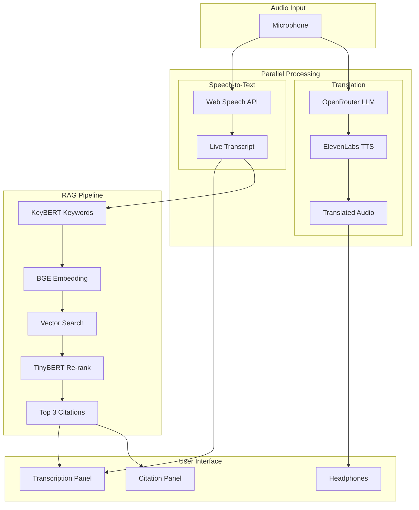
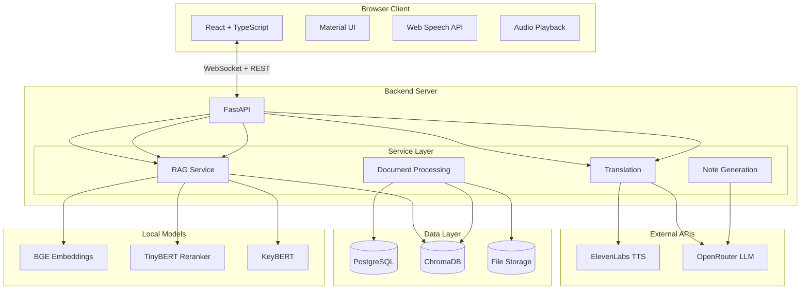

# Rosetta

**Real-time lecture translation and learning assistant**

Rosetta helps international students and language learners break through language barriers in real-time. It provides live lecture translation, automatic transcription, intelligent citations from course materials, and structured note generation.

*"Your voice in every language"*

---

## The Problem

Over 6 million students study abroad annually. Most attend institutions where instruction is delivered in a language that is not their native tongue. These students:

- Miss critical content while mentally translating
- Spend hours post-lecture reconstructing what was said
- Experience cognitive fatigue that reduces retention
- Hesitate to participate due to language anxiety

Rosetta exists because language should never be a barrier to education.

---

## How It Works

Rosetta operates through three parallel pipelines during live lectures:



**Translation Pipeline:** Captures audio via Web Speech API, translates text through OpenRouter (Claude 3 Haiku), and outputs natural speech via ElevenLabs TTS. End-to-end latency under 2 seconds.

**RAG Pipeline:** Transcript segments trigger semantic searches against uploaded course materials. Citations appear inline as superscript numbers with varying opacity based on relevance.

**Note Generation:** After the lecture, an LLM reorganizes the transcript into structured notes with headings, bullet points, and embedded citations.

---

## System Architecture



---

## Technical Highlights

### RAG Pipeline Optimization

The citation pipeline needed to feel instantaneous during live lectures. We reduced latency from 400-950ms to 70-125ms through:

| Component | Before | After |
|-----------|--------|-------|
| Query Enrichment | 2x LLM API calls (200-600ms) | KeyBERT local (10-30ms) |
| Embeddings | OpenAI API (80-150ms) | BGE local (5-15ms) |
| Re-ranking | 10 candidates, MiniLM (100-150ms) | 5 candidates, TinyBERT (30-40ms) |
| Early Exit | None | Distance threshold gating |

The key insight: local models with sentence-transformers provide 10x faster inference with minimal quality loss for educational content retrieval.

### Real-Time Translation

Translation uses a text-based pipeline rather than direct speech-to-speech:

1. Web Speech API transcribes professor audio
2. OpenRouter translates English to target language
3. ElevenLabs synthesizes natural-sounding speech
4. Audio streams to the student's headphones

This approach lets us simultaneously display transcripts, trigger RAG queries, and store segments for note generation.

### Dynamic Internationalization

The entire UI supports 6 languages with real-time switching. All copy lives in a Zustand store with language-specific translations. Changing your base language updates every label, button, and message instantly.

---

## Tech Stack

| Layer | Technology |
|-------|------------|
| Frontend | React 18, TypeScript, Material UI, TanStack Query, Zustand, TipTap |
| Backend | FastAPI, Python 3.11, SQLAlchemy, Alembic |
| Databases | PostgreSQL (relational), ChromaDB (vectors) |
| Real-time | WebSockets for transcription and translation streams |
| AI/ML | ElevenLabs TTS, OpenRouter (Claude 3 Haiku), BGE embeddings, KeyBERT, TinyBERT |
| PDF | WeasyPrint for note export |
| Infrastructure | Docker, Docker Compose |

---

## Supported Languages

| Code | Language |
|------|----------|
| en | English (source) |
| zh | Chinese (Mandarin) |
| hi | Hindi |
| es | Spanish |
| fr | French |
| bn | Bengali |

---

## Project Structure

```
rosetta/
├── frontend/              # React application
│   ├── src/
│   │   ├── components/    # Shared UI components
│   │   ├── features/      # Feature modules (sessions, notes, etc.)
│   │   ├── hooks/         # Custom React hooks
│   │   ├── services/      # API client
│   │   ├── stores/        # Zustand state management
│   │   └── theme/         # Material UI theming
│   └── package.json
│
├── backend/               # FastAPI application
│   ├── app/
│   │   ├── api/           # Route handlers
│   │   ├── core/          # Config and database
│   │   ├── models/        # SQLAlchemy models
│   │   ├── schemas/       # Pydantic DTOs
│   │   ├── services/      # Business logic
│   │   ├── repositories/  # Data access
│   │   └── external/      # API clients
│   ├── alembic/           # Database migrations
│   └── requirements.txt
│
├── docker/                # Docker Compose for PostgreSQL and ChromaDB
└── docs/                  # PRD and FRDs
```

---

## Getting Started

See [QUICKSTART.md](QUICKSTART.md) for setup instructions, or [docs/SETUP_GUIDE.md](docs/SETUP_GUIDE.md) for detailed configuration.

**Prerequisites:**
- Docker and Docker Compose
- Node.js 18+ and npm
- Python 3.11+
- ElevenLabs API key
- OpenRouter API key

---

## Documentation

- [Product Requirements Document](docs/PRD.md) - Full product specification
- [Setup Guide](docs/SETUP_GUIDE.md) - Detailed installation instructions
- [RAG Pipeline Refinements](docs/RAG_PIPELINE_REFINEMENTS.md) - Performance optimizations

Feature specifications:
- [FRD-00: Project Setup](docs/FRDs/FRD-00-project-setup.md)
- [FRD-01: Folder Organization](docs/FRDs/FRD-01-folder-organization.md)
- [FRD-02: Document Management](docs/FRDs/FRD-02-document-management.md)
- [FRD-03: Speech Translation](docs/FRDs/FRD-03-speech-translation.md)
- [FRD-04: Live Transcription](docs/FRDs/FRD-04-live-transcription.md)
- [FRD-05: RAG Pipeline](docs/FRDs/FRD-05-rag-pipeline.md)
- [FRD-06: Question Translation](docs/FRDs/FRD-06-question-translation.md)
- [FRD-07: Note Generation](docs/FRDs/FRD-07-note-generation.md)

---

## API Documentation

When the backend is running:
- Swagger UI: http://localhost:8080/docs
- ReDoc: http://localhost:8080/redoc

---

## Contributing

1. Fork the repository
2. Create a feature branch
3. Make your changes
4. Open a pull request

---

## Team

Built for HackHive 2026 by:
- Abeer Das
- Aaron Chow
- Tawsif Mayaz
- Aryan Kansagara

---

## License

MIT License - see [LICENSE](LICENSE) for details.
