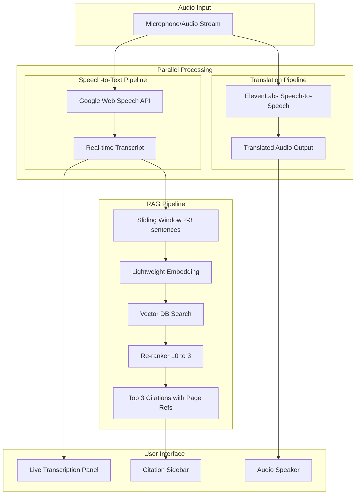
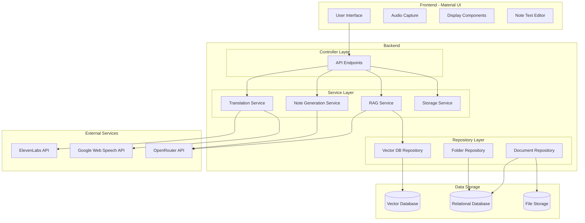

# Product Requirements Document - LectureLens

## Executive Summary

LectureLens is a real-time lecture translation and learning assistant that breaks down language barriers for students in educational settings. The application captures professor speech, translates it in real-time through natural-sounding voice synthesis, and intelligently surfaces relevant course materials as citations alongside the translation.

**Hackathon Context:** HackHive 2026 | Tracks: Best Accessibility Hack + Best Use of ElevenLabs

**Core Value Proposition:** Enable equitable classroom participation regardless of native language through AI-powered real-time translation with contextual learning support.

**Key Capabilities:**
- Real-time speech translation via ElevenLabs Speech-to-Speech API
- Live transcription display via Google Web Speech API
- RAG-powered citation retrieval from uploaded course materials (PDFs)
- Folder-based organization for sessions and notes
- Post-lecture structured note generation with embedded citations
- Question translation for classroom participation

**Supported Languages:** English, Hindi, Chinese, French, Spanish, Bengali

---

## Problem Statement

### The Problem

International and ESL students face significant barriers when attending lectures in a language that is not their native tongue. According to UNESCO, over 6 million students study abroad annually, with the majority attending institutions where instruction is delivered in a second language. These students often:

- Miss critical lecture content due to processing delays when mentally translating
- Struggle to connect spoken concepts with course materials written in the instruction language
- Spend excessive time post-lecture trying to reconstruct what was said
- Experience cognitive fatigue from constant translation effort, reducing comprehension and retention
- Hesitate to ask questions in class due to language barriers

### Current Solutions Gap

Existing solutions fail to address the complete problem:

| Solution | Limitation |
|----------|------------|
| Live human interpreters | Expensive, not scalable, unavailable for most courses |
| Post-lecture transcription | No real-time benefit; students still lost during class |
| Generic translation apps | No course context; cannot align with learning materials |
| Recorded lecture translation | Delays learning; no immediate engagement |

### AI-First Justification

LectureLens requires sophisticated multi-model AI orchestration that goes far beyond basic API calls:

1. **Parallel Speech Processing**: Simultaneous speech-to-text (for transcription/RAG) and speech-to-speech translation (for audio output)
2. **Real-Time Semantic Understanding**: Sliding window embedding of professor speech for contextual RAG queries
3. **Agentic RAG Pipeline**: Keyword extraction, query enrichment, semantic search, and re-ranking to surface the 3 most relevant course documents
4. **Citation Alignment**: Matching English course materials to translated output with page references
5. **Intelligent Summarization**: LLM-powered note generation that preserves structure and citations

This multi-stage pipeline creates genuine AI-first value that cannot be replicated with simple API wrappers.

### Impact

- **Educational Equity**: Levels the playing field for non-native speakers
- **Accessibility**: Addresses a real barrier faced by millions of students globally
- **Learning Outcomes**: Improved comprehension and retention through native-language delivery plus contextual materials
- **Cognitive Load Reduction**: Students focus on learning, not translating
- **Classroom Participation**: Question translation enables students to participate actively

---

## Product Description

LectureLens is a web application that transforms the lecture experience for students facing language barriers. The system operates in real-time during live lectures, providing three parallel outputs:

1. **Translated Audio**: Natural-sounding speech in the student's preferred language, delivered through their device speakers or headphones
2. **Live Transcription Display**: Real-time voice-to-text transcription appearing dynamically as the professor speaks, displayed in a visual panel
3. **Contextual Citations**: Relevant course materials automatically surfaced based on what the professor is discussing

After the lecture concludes, students can generate comprehensive, structured notes that combine the full translated transcript with all citations, formatted for effective study and review. Notes are organized within a folder-based system for easy access and management.

### Design Principles

- **Real-Time First**: Every feature prioritizes low latency for live lecture use
- **Context-Aware**: RAG pipeline connects spoken content to uploaded course materials
- **Accessibility-Native**: Multi-sensory output (audio + visual) with screen reader support
- **Privacy-Conscious**: Session data managed with clear retention policies
- **Material Design**: Sleek, modern UI built with Material UI components

---

## User Personas

### Primary Persona: International Graduate Student

**Profile:** Wei, 24, Computer Science Master's Student from China

- Enrolled in English-medium university in North America
- Strong technical skills but struggles with fast-paced English lectures
- Often misses key points while mentally translating technical terms
- Spends 2-3 hours after each lecture reviewing and reconstructing notes

**Needs:**
- Understand lecture content in real-time without cognitive translation burden
- Connect spoken concepts to course readings
- Generate comprehensive notes for later review
- Ask questions in class without language anxiety

**Success Criteria:**
- Can follow along with lecture in Mandarin while professor speaks English
- Relevant textbook pages appear automatically when professor discusses concepts
- Post-lecture notes capture all key points with proper citations
- Can type a question in Mandarin and get an English translation to ask the professor

### Secondary Persona: ESL Undergraduate in STEM

**Profile:** Priya, 20, Biology Major from India

- Fluent in Hindi and conversational English
- Struggles with technical vocabulary and fast-speaking professors
- Visual learner who benefits from seeing text alongside audio
- Wants to improve English while still understanding content

**Needs:**
- Live transcription to follow along visually while listening
- Quick reference to course materials during confusing explanations
- Study notes that help reinforce both subject matter and English vocabulary

**Success Criteria:**
- Sees real-time transcription appearing as professor speaks
- Can click on citations to review relevant course material sections
- Notes include original English terms alongside Hindi explanations

### Tertiary Persona: Accessibility Coordinator

**Profile:** Dr. Martinez, 45, University Disability Services Director

- Responsible for ensuring equitable access for all students
- Evaluating technology solutions for language accessibility
- Concerned about privacy, scalability, and ease of deployment

**Needs:**
- Solution that works across multiple departments and courses
- Clear data handling policies for compliance
- Minimal setup burden for students and faculty

**Success Criteria:**
- Students can self-serve without IT intervention
- System supports multiple language pairs
- Clear documentation on data retention and privacy

---

## Core Technical Pipeline

The system operates through parallel processing pipelines that work simultaneously to minimize latency.

### Pipeline Overview



### Pipeline Timing Targets

| Stage | Target Latency |
|-------|----------------|
| Speech-to-Text (Google Web Speech) | < 300ms |
| Speech-to-Speech Translation (ElevenLabs) | < 2000ms |
| Sliding Window Accumulation | ~5-10 seconds (2-3 sentences) |
| Embedding Generation | < 100ms |
| Vector Search + Re-ranking | < 200ms |
| Total RAG Pipeline | < 500ms after window completion |

---

## Product Features

### Feature 1: Real-Time Speech Translation

**Description:** Capture professor speech via microphone and output natural-sounding translated audio through ElevenLabs Speech-to-Speech API.

**Requirements:**
- Continuous audio capture from device microphone or system audio
- Real-time streaming to ElevenLabs Speech-to-Speech API
- Natural voice synthesis in target language (not robotic TTS)
- Audio output through device speakers or headphones
- Volume control and mute functionality
- Language selection from supported options

**Supported Language Pairs:**
- English ↔ Hindi
- English ↔ Chinese (Mandarin)
- English ↔ French
- English ↔ Spanish
- English ↔ Bengali

**Latency Target:** Less than 2 seconds from speech to translated audio output

### Feature 2: Live Transcription Display

**Description:** Display real-time voice-to-text transcription as the professor speaks, rendered dynamically in a dedicated panel using Google Web Speech API.

**Requirements:**
- Real-time speech-to-text via Google Web Speech API
- Live transcription appearing word-by-word or phrase-by-phrase as detected
- Dedicated right-side panel for transcription display
- Smooth scrolling with auto-scroll to latest content
- Visual indication of active speech detection
- Configurable font size and contrast for accessibility
- Timestamp markers for key segments

**Visual Design:**
- Text appears dynamically as speech is detected, creating a "typing" effect
- Current sentence highlighted or distinguished from previous content
- Clean, readable typography optimized for extended reading
- Material UI styling with smooth animations

**Latency Target:** Less than 300ms from speech to text display

### Feature 3: Course Document Management

**Description:** Allow users to upload, view, and manage course materials (PDF documents) that are automatically chunked, embedded, and indexed for RAG retrieval.

**Requirements:**
- Support for PDF file uploads (text-based documents only, no slides)
- Automatic text extraction with page number preservation
- Intelligent chunking with appropriate segment sizes
- Metadata attachment including page number, document name, and section heading
- Progress indicator during processing
- **Full CRUD operations for document management:**
  - **Create**: Upload new PDF documents
  - **Read**: View list of uploaded documents with metadata
  - **Update**: Replace existing documents with new versions
  - **Delete**: Remove documents and their associated embeddings

**Document Management UI (Side Panel):**
- List view of all uploaded documents
- Upload button with drag-and-drop support
- Document cards showing name, page count, and upload date
- Delete button with confirmation dialog
- Processing status indicator (pending, indexing, ready, error)
- Search/filter functionality for documents

**Document Enrichment Process:**
1. Extract text from PDF with page boundaries
2. Chunk into appropriate segments with overlap for context continuity
3. Extract section headings where available
4. Generate embeddings using OpenRouter-accessed embedding models
5. Optionally enrich chunks with summary and key concepts
6. Store with metadata for efficient retrieval

**Supported Document Types:**
- PDF files containing text-based lecture notes, textbook chapters, or reading materials
- Note: Slide decks and image-heavy documents are not supported in this version

### Feature 4: Real-Time RAG Pipeline

**Description:** Continuously analyze professor speech to surface relevant course materials as citations displayed alongside the translation.

**Requirements:**
- Sliding window trigger that accumulates 2-3 sentences before initiating RAG query
- Lightweight embedding generation for low latency
- Semantic search against course document index
- Agentic query enrichment for improved retrieval accuracy
- Re-ranking from 10 candidates to 3 final citations
- Display citations with document name, page number, and relevance indicator
- Clickable citations to preview content

**Agentic RAG Flow:**

```mermaid
flowchart LR
    subgraph trigger [Trigger Logic]
        TRANSCRIPT[Transcript Buffer]
        DETECT[Sentence Boundary Detection]
        WINDOW[Sliding Window]
        TRANSCRIPT --> DETECT
        DETECT --> WINDOW
    end
    
    subgraph enrich [Query Enrichment]
        KEYWORDS[Keyword Extraction]
        CONCEPTS[Concept Expansion]
        QUERY[Enriched Query]
        WINDOW --> KEYWORDS
        KEYWORDS --> CONCEPTS
        CONCEPTS --> QUERY
    end
    
    subgraph retrieve [Retrieval]
        EMBED[Embed Query]
        SEARCH[Vector Search Top 10]
        RERANK[Cross-Encoder Re-rank]
        TOP3[Top 3 Results]
        QUERY --> EMBED
        EMBED --> SEARCH
        SEARCH --> RERANK
        RERANK --> TOP3
    end
    
    subgraph display [Display]
        CITATIONS[Citation Cards]
        TOP3 --> CITATIONS
    end
```



**Query Enrichment Strategy:**
1. **Keyword Extraction:** Extract key terms and entities from the transcript window
2. **Concept Expansion:** Expand query with related academic concepts
3. **Query Formulation:** Combine original window text with extracted keywords and concepts

**Latency Target:** Less than 500ms from window completion to citation display

### Feature 5: Question Translation Assistant

**Description:** Enable students to type questions in their native language and receive an English translation they can ask the professor, facilitating active classroom participation.

**Requirements:**
- Text input field for typing questions in any supported language
- Real-time translation to English via OpenRouter LLM
- Copy-to-clipboard functionality for the translated question
- Translation history within the session
- Language auto-detection or manual selection

**UI Design:**
- Accessible via a collapsible panel or modal
- Clear input field with placeholder text: "Type your question in your language..."
- Translated output displayed below with copy button
- Visual feedback during translation processing
- Option to speak the translated question (text-to-speech)

**Use Case Flow:**
1. Student has a question but is unsure how to phrase it in English
2. Student opens Question Assistant and types question in native language
3. System translates to grammatically correct English
4. Student copies translation and raises hand to ask, or types in chat

### Feature 6: Post-Lecture Note Generation

**Description:** Generate comprehensive, structured lecture notes from the full translated transcript with embedded citations, with full editing capabilities.

**Requirements:**
- Trigger via "Structure into Notes" button located in the top-left of the text editor interface
- Button can be pressed at any point during or after the lecture
- Compile full translated transcript with all citations
- LLM-powered restructuring into organized format via OpenRouter
- Predefined template with headings, subheadings, and bullet points
- Preserve citation references with page numbers
- **Export as PDF only** (LLM generates structured Markdown, rendered and exported as PDF)
- **Full text editor functionality** when reopening saved notes

**Note Editor Features:**
- Rich text editing capabilities
- "Structure into Notes" button prominently placed in top-left toolbar
- Real-time editing with auto-save
- Markdown preview mode
- PDF export button
- Material UI-styled editor interface

**Note Structure:**
- Key Concepts section with bullet point summary of main topics
- Detailed Notes organized under logical section headings
- Points include citation references in standard format
- Citations Referenced section with ordered list of documents and pages
- Summary paragraph capturing main takeaways

---

## Note Storage and Organization

### Folder-Based Organization System

**Description:** A hierarchical storage system that allows students to organize their lecture sessions, notes, and course materials within folders.

### Folder Structure

```
📁 Course Folder (e.g., "CS 401 - Machine Learning")
├── 📁 Session: Lecture 1 - Introduction (2026-01-20)
│   ├── 📄 Post-Lecture Notes.pdf
│   └── 📄 uploaded_context_chapter1.pdf
├── 📁 Session: Lecture 2 - Linear Regression (2026-01-22)
│   ├── 📄 Post-Lecture Notes.pdf
│   ├── 📄 uploaded_context_chapter2.pdf
│   └── 📄 uploaded_context_slides.pdf
└── 📁 Session: Lecture 3 - Neural Networks (2026-01-24)
    └── 🔴 [In Progress - Session Active]
```

### Folder Management

**Requirements:**
- Create new folders (courses/subjects)
- Rename folders
- Delete folders (with confirmation and cascade delete warning)
- Drag-and-drop organization
- Search across all folders and notes

**Folder Properties:**
- Name
- Created date
- Last modified date
- Number of sessions
- Total storage used

### Session Lifecycle

**Starting a Session:**
1. User navigates to a folder (or creates one)
2. User clicks "Start New Session"
3. User uploads PDF context documents for this session (optional)
4. User begins lecture with translation/transcription active

**During a Session:**
- Real-time transcription and translation active
- Citations from uploaded PDFs appear in sidebar
- Session state saved continuously

**Ending a Session:**
1. User clicks "End Session"
2. System prompts: "Generate structured notes now or save transcript only?"
3. If generating notes: LLM processes transcript into structured format
4. Session saved to folder with:
   - Post-lecture notes (editable, exportable as PDF)
   - All PDF documents uploaded for that session
   - Session metadata (date, duration, languages used)

### Stored Content Per Session

| Content Type | Description | Editable | Exportable |
|--------------|-------------|----------|------------|
| Post-Lecture Notes | LLM-generated structured notes | Yes (text editor) | PDF only |
| PDF Context Documents | Uploaded course materials | No (read-only) | N/A (already PDFs) |
| Session Metadata | Date, duration, languages | No | Included in notes |

### Notes Retrieval and Editing

**Reopening Notes:**
1. Navigate to folder → session
2. Click on "Post-Lecture Notes"
3. Notes open in full text editor view
4. Edit freely with all formatting options
5. Changes auto-saved
6. Export to PDF when ready

**Editor Toolbar (Top):**
- **Left Side:** "Structure into Notes" button (re-generate from transcript)
- **Center:** Formatting options (bold, italic, headers, lists)
- **Right Side:** Export to PDF button

### Data Model for Storage

**Folders Table:**
- `id`: Unique identifier
- `name`: Folder name
- `user_id`: Owner
- `created_at`: Timestamp
- `updated_at`: Timestamp

**Sessions Table:**
- `id`: Unique identifier
- `folder_id`: Parent folder reference
- `name`: Session name/title
- `source_language`: Original lecture language
- `target_language`: Translation language
- `started_at`: Session start time
- `ended_at`: Session end time
- `status`: (active, completed, archived)

**Notes Table:**
- `id`: Unique identifier
- `session_id`: Parent session reference
- `content_markdown`: Structured notes in Markdown
- `generated_at`: When notes were generated
- `last_edited_at`: Last edit timestamp
- `version`: Version number for edit history

**Session Documents Table:**
- `id`: Unique identifier
- `session_id`: Parent session reference
- `document_id`: Reference to uploaded document
- `uploaded_at`: When added to session

---

## Technical Architecture

### System Architecture Overview



### Technology Stack

| Component | Technology | Purpose |
|-----------|------------|---------|
| Frontend | React + TypeScript | User interface, audio capture, real-time display |
| UI Framework | Material UI (MUI) | Sleek, modern component library |
| Styling | Material UI + Custom Theming | Consistent design system |
| Backend | FastAPI + Python | API endpoints, business logic |
| Validation | Pydantic | Request/response schema validation |
| Vector Database | Chroma | Course document and session embedding storage |
| Relational Database | SQLite/PostgreSQL | User sessions, folders, notes, document metadata |
| File Storage | Local filesystem / S3 | PDF document storage |
| Speech-to-Speech | ElevenLabs API | Real-time translation with natural voice |
| Speech-to-Text | Google Web Speech API | Live transcription, RAG input |
| Embeddings | OpenRouter API | Access to multiple embedding models |
| LLM | OpenRouter API | Query enrichment, note generation, question translation |
| Re-ranking | Sentence Transformers | Cross-encoder for citation ranking |
| Real-time Communication | WebSocket | Streaming audio and transcription |
| Text Editor | TipTap or Slate.js | Rich text editing for notes |
| PDF Generation | react-pdf or pdfmake | Export notes to PDF |

### Backend Architecture Pattern

The backend follows the Controller-Service-Repository pattern with dependency injection for clean separation of concerns and testability.

**Controller Layer:** Handles API endpoint definitions and request/response handling. Routes requests to appropriate services.

**Service Layer:** Contains business logic and orchestration. Coordinates between external APIs and repositories.

**Repository Layer:** Abstracts data access. Provides clean interface for vector database, relational database, and file storage operations.

**Data Transfer Objects (DTOs):** All API contracts use Pydantic models for validation and documentation.

### API Endpoints Overview

| Endpoint | Method | Purpose |
|----------|--------|---------|
| **Session Management** | | |
| `/folders` | GET | List all folders |
| `/folders` | POST | Create new folder |
| `/folders/{id}` | PUT | Update folder |
| `/folders/{id}` | DELETE | Delete folder |
| `/folders/{id}/sessions` | GET | List sessions in folder |
| `/sessions` | POST | Start new session |
| `/sessions/{id}` | PUT | Update session |
| `/sessions/{id}/end` | POST | End session |
| **Translation & Transcription** | | |
| `/translate/stream` | WebSocket | Stream audio for translation |
| `/transcribe/stream` | WebSocket | Stream audio for speech-to-text |
| `/translate/question` | POST | Translate question text |
| **Document Management** | | |
| `/documents` | GET | List all documents |
| `/documents` | POST | Upload new document |
| `/documents/{id}` | GET | Get document details |
| `/documents/{id}` | DELETE | Delete document |
| `/documents/{id}/status` | GET | Check indexing progress |
| **RAG & Citations** | | |
| `/rag/query` | POST | Query for citations |
| **Notes** | | |
| `/sessions/{id}/notes` | GET | Get session notes |
| `/sessions/{id}/notes` | PUT | Update session notes |
| `/sessions/{id}/notes/generate` | POST | Generate structured notes |
| `/sessions/{id}/notes/export` | GET | Export notes as PDF |

### Data Model Overview

**Folders:** Stores course/subject organization with name, user ownership, and timestamps.

**Sessions:** Stores lecture session information including folder reference, source and target languages, timestamps, and status.

**Documents:** Tracks uploaded course materials with filename, processing status, page count, chunk count, and session associations.

**Transcripts:** Stores original and translated text segments with timestamps for each session.

**Citations:** Records retrieved citations with document reference, page number, relevance score, and triggering transcript.

**Notes:** Stores generated lecture notes in Markdown format with generation timestamp and edit history.

---

## Technical Recommendations

Based on research into available tools and hackathon constraints:

| Component | Recommendation | Rationale |
|-----------|----------------|-----------|
| Vector DB | Chroma | Python-native, lightweight, easy local setup, no external dependencies |
| LLM Access | OpenRouter | Single API for multiple models (GPT-4, Claude, Llama), flexible pricing |
| Real-time Embedding | text-embedding-3-small (via OpenRouter) | Low latency, sufficient quality for semantic search |
| Course Doc Embedding | text-embedding-3-large (via OpenRouter) | Higher quality, no latency constraint during indexing |
| Re-ranker | Cross-encoder MiniLM | Fast (~12ms per comparison), high accuracy, runs locally |
| Note Generation | Claude 3 Haiku / GPT-4o-mini (via OpenRouter) | Fast inference, cost-effective, excellent at structured formatting |
| Query Enrichment | Claude 3 Haiku (via OpenRouter) | Can extract keywords and expand concepts efficiently |
| Question Translation | GPT-4o-mini (via OpenRouter) | Fast, accurate translation with context awareness |
| UI Framework | Material UI v5 | Modern, accessible, comprehensive component library |
| Text Editor | TipTap | Headless, customizable, Markdown support |
| Embedding Storage | Chroma with session tags | Unified search, easy cleanup via metadata filter |

### OpenRouter Integration

**Benefits:**
- Single API key for multiple model providers
- Automatic fallback if a model is unavailable
- Cost tracking and rate limiting built-in
- Access to latest models without code changes

**Model Selection Strategy:**
- Use faster, cheaper models for real-time operations (embeddings, query enrichment)
- Use higher-quality models for note generation (better structure and coherence)
- Configure fallback chains for reliability

### Embedding Storage Strategy

**For Course Documents (Persistent):**
- Stored in dedicated collection
- Includes metadata for document ID, page number, heading, and user ID
- Persists across sessions

**For Session Transcripts (Ephemeral):**
- Stored in separate collection with session tagging
- Includes metadata for session ID, timestamp, and window index
- Automatically cleaned up when session ends

---

## User Interface Design

### Design System

**Framework:** Material UI (MUI) v5

**Design Principles:**
- Clean, modern aesthetic with ample whitespace
- Consistent use of Material Design 3 principles
- High contrast for accessibility
- Responsive layout for various screen sizes

**Color Palette:**
- Primary: Deep blue (#1976d2)
- Secondary: Teal accent (#009688)
- Background: Light gray (#fafafa) / Dark mode: (#121212)
- Surface: White (#ffffff) / Dark mode: (#1e1e1e)
- Error: Red (#d32f2f)
- Success: Green (#388e3c)

**Typography:**
- Primary font: Roboto
- Monospace (code/transcription): JetBrains Mono
- Scale following Material Design type scale

### Main Application Layout

```
┌─────────────────────────────────────────────────────────────────┐
│  [Logo] LectureLens          [Language: EN→HI ▼]  [Settings] [?]│
├────────────┬────────────────────────────────────┬───────────────┤
│            │                                    │               │
│  FOLDERS   │     LIVE TRANSCRIPTION PANEL      │   CITATIONS   │
│  & DOCS    │                                    │   SIDEBAR     │
│            │  "Today we'll discuss the          │               │
│ 📁 CS 401  │   fundamentals of machine          │ 📄 Ch.1 p.12  │
│   └─ Lec 1 │   learning. The key concept        │   "Machine    │
│   └─ Lec 2 │   is supervised learning where..." │   learning    │
│ 📁 MATH 301│                                    │   basics..."  │
│            │  [Text appears dynamically]        │               │
│ ───────────│                                    │ 📄 Ch.2 p.45  │
│ DOCUMENTS  │                                    │   "Supervised │
│ + Add PDF  │                                    │   learning..."│
│ 📄 Ch1.pdf │                                    │               │
│ 📄 Ch2.pdf │──────────────────────────────────│               │
│   [🗑️]     │  💬 Ask a Question                │               │
│            │  [Type in your language...]       │               │
├────────────┴────────────────────────────────────┴───────────────┤
│  [🎤 Recording] [⏸️ Pause] [⏹️ End Session]    [🔊 Vol] [📝 Notes]│
└─────────────────────────────────────────────────────────────────┘
```

### Note Editor View

```
┌─────────────────────────────────────────────────────────────────┐
│  ← Back to Session                              [Export PDF 📥] │
├─────────────────────────────────────────────────────────────────┤
│  [📝 Structure into Notes]  │ B I U │ H1 H2 │ • 1. │ Link │    │
├─────────────────────────────────────────────────────────────────┤
│                                                                 │
│  # Lecture Notes: Machine Learning Introduction                 │
│  Date: January 20, 2026 | Duration: 50 min                     │
│                                                                 │
│  ## Key Concepts                                                 │
│  - Supervised learning fundamentals                             │
│  - Training vs. test data [1, p.12]                            │
│  - Model evaluation metrics                                     │
│                                                                 │
│  ## Detailed Notes                                              │
│                                                                 │
│  ### Introduction to Machine Learning                           │
│  Machine learning is a subset of artificial intelligence...    │
│                                                                 │
│  [Editable content continues...]                               │
│                                                                 │
│  ## Citations Referenced                                        │
│  1. Chapter 1 - ML Fundamentals, p.12                          │
│  2. Chapter 2 - Supervised Learning, p.45                      │
│                                                                 │
└─────────────────────────────────────────────────────────────────┘
```

### Key UI Components

**Folder Panel (Left Sidebar):**
- Collapsible folder tree
- Session list under each folder
- Document management section
- Add/Delete buttons with Material UI icons

**Transcription Panel (Center):**
- Large, readable text area
- Text appears dynamically as speech is detected
- Auto-scroll with "scroll to latest" button
- Timestamp markers every few minutes

**Citation Sidebar (Right):**
- Card-based citation display
- Document name, page number, relevance score
- Expandable preview on hover/click
- Click to open full document view

**Question Assistant:**
- Collapsible input area at bottom of transcription panel
- Clean text input with language indicator
- Copy button for translated output

**Control Bar (Bottom):**
- Recording status indicator
- Play/Pause/Stop controls
- Volume slider
- Quick access to note generation

---

## Success Metrics

### Core Performance Metrics

| Metric | Target | Measurement Method |
|--------|--------|-------------------|
| Translation Latency | < 2 seconds | Time from speech end to audio output start |
| Transcription Latency | < 300ms | Time from speech to text display |
| RAG Query Latency | < 500ms | Time from window trigger to citation display |
| Translation Quality | User satisfaction 4+/5 | Post-session rating |
| Citation Relevance | 80%+ precision | User feedback on displayed citations |
| Note Quality | Captures 90%+ concepts | Comparison with manual notes |

### Hackathon Demo Metrics

| Metric | Target |
|--------|--------|
| Supported Languages | 6 (English, Hindi, Chinese, French, Spanish, Bengali) |
| Document Types | PDF (text-based) |
| Concurrent Users | 1 (demo mode) |
| Session Duration | Up to 2 hours |
| Document Size | Up to 100 pages |

### User Experience Metrics

| Metric | Target |
|--------|--------|
| Time to First Translation | < 5 seconds after session start |
| Time to First Citation | < 15 seconds after relevant content spoken |
| Note Generation Time | < 30 seconds for 1-hour lecture |
| Setup Time | < 2 minutes (folder creation + document upload + language selection) |
| Question Translation | < 2 seconds |

---

## Responsibility and Ethics

### Data Privacy

- **Audio Data**: Streamed directly to external APIs; not stored on our servers
- **Transcripts**: Stored for session duration only; deleted on session end (configurable)
- **Course Documents**: Stored in user's isolated namespace; user can delete at any time
- **Session Embeddings**: Ephemeral; automatically cleaned up after session
- **Notes**: Stored persistently until user deletes; user has full control

### Transparency

- **Translation Confidence**: Display confidence indicators when translation quality may be uncertain
- **Citation Relevance**: Show relevance scores so users understand why documents were surfaced
- **AI Limitations**: Clear disclosure that translations may not capture nuance; recommend verification for critical content

### Accessibility

- **Multi-Sensory Output**: Audio translation plus visual transcription plus written citations
- **Screen Reader Support**: ARIA labels and semantic HTML throughout
- **Keyboard Navigation**: Full functionality without mouse
- **High Contrast Mode**: User-configurable display settings
- **Font Scaling**: Adjustable transcription and citation text size
- **Material UI Accessibility**: Built-in a11y compliance from component library

### Bias Mitigation

- **Accent Testing**: Validate translation quality across diverse speaker accents
- **Language Pair Quality**: Acknowledge varying quality across language pairs
- **Feedback Mechanism**: Allow users to flag translation errors for improvement

### Responsible AI Practices

- **Human Oversight**: Users can pause, review, and correct translations
- **No Permanent Recording**: Audio is processed in real-time, not recorded
- **Consent**: Clear user consent before microphone activation
- **Rate Limiting**: Prevent abuse of external APIs

---

## Hackathon Track Alignment

### Best Accessibility Hack

LectureLens directly addresses accessibility by removing language barriers that prevent millions of students from fully participating in education.

| Criterion | How LectureLens Addresses It |
|-----------|------------------------------|
| Real Problem | 6M+ international students struggle with language barriers in lectures |
| Underrepresented Users | ESL students, immigrants, students from non-English speaking countries |
| Multi-Sensory | Audio translation plus visual transcription plus written citations |
| Inclusive Design | Screen reader support, keyboard navigation, high contrast, Material UI a11y |
| Measurable Impact | Improved comprehension, reduced cognitive load, better retention |

**Accessibility Features:**
1. Real-time audio translation eliminates need for mental translation
2. Live transcription display provides visual reinforcement
3. Citation sidebar provides contextual reference to concepts
4. Question translation enables classroom participation
5. Structured notes enable effective review without replay
6. Configurable display settings for visual accessibility

### Best Use of ElevenLabs

LectureLens showcases ElevenLabs as the core enabler of the translation experience.

| Criterion | How LectureLens Uses ElevenLabs |
|-----------|--------------------------------|
| Central to Product | Speech-to-Speech API is the primary translation engine |
| Real-Time Streaming | Continuous audio output during live lectures |
| Natural Voice Quality | Human-like synthesis, not robotic TTS |
| Multi-Language | Leverages ElevenLabs' language support for 6 target languages |
| User Value | Natural-sounding translation enables comfortable listening for hours |

**ElevenLabs Integration Highlights:**
1. Primary translation pipeline, not just a supplementary feature
2. WebSocket streaming for minimal latency
3. Voice quality that does not cause listener fatigue
4. Language selection integrated into user preferences

---

## Code Integrity and Engineering Quality (Bonus Criteria)

### Architecture Patterns

- **Controller-Service-Repository**: Clean separation of concerns across layers
- **Dependency Injection**: All services injected for testability and flexibility
- **DTO Pattern**: Pydantic models for all API contracts
- **Repository Abstraction**: Data access isolated from business logic

### Code Quality Practices

- **Type Hints**: Full Python type annotations throughout
- **Validation**: Request/response validation with clear error messages
- **Async Processing**: Non-blocking I/O for all external API calls
- **Error Handling**: Consistent error responses with appropriate status codes

### Scalability Considerations

- **Stateless Services**: No server-side session state; all state in database
- **Horizontal Scaling**: Services can be replicated behind load balancer
- **Background Tasks**: Long-running operations run asynchronously
- **Caching Strategy**: Frequently accessed embeddings cached in memory

### Testing Strategy

- **Unit Tests**: Service layer logic with mocked dependencies
- **Integration Tests**: API endpoints with test database
- **End-to-End Tests**: Critical user flows automated

---

## Appendix

### A. Supported Languages

| Language | Code | ElevenLabs Support | Google STT Support |
|----------|------|-------------------|-------------------|
| English | en | Yes | Yes |
| Hindi | hi | Yes | Yes |
| Chinese (Mandarin) | zh | Yes | Yes |
| French | fr | Yes | Yes |
| Spanish | es | Yes | Yes |
| Bengali | bn | Yes | Yes |

### B. Glossary

| Term | Definition |
|------|------------|
| RAG | Retrieval-Augmented Generation - technique to enhance LLM responses with retrieved context |
| STT | Speech-to-Text - converting spoken audio to written text |
| TTS | Text-to-Speech - converting written text to spoken audio |
| Embedding | Vector representation of text for semantic similarity comparison |
| Re-ranking | Process of reordering search results using a more sophisticated model |
| Sliding Window | Technique of processing text in overlapping segments |
| Cross-encoder | Model that scores relevance between query and document pairs |
| OpenRouter | API aggregator providing unified access to multiple LLM providers |
| Material UI | React component library implementing Google's Material Design |

### C. Dependencies

**External APIs:**
- ElevenLabs Speech-to-Speech API
- Google Web Speech API
- OpenRouter API (for LLM and embeddings access)

**Key Libraries:**
- Chroma (vector database)
- Sentence Transformers (re-ranking)
- FastAPI (backend framework)
- Pydantic (validation)
- React (frontend framework)
- Material UI / MUI (component library)
- TipTap (text editor)
- react-pdf / pdfmake (PDF export)

### D. Future Considerations

- Support for additional language pairs
- Speaker diarization for multi-speaker lectures
- Integration with learning management systems
- Mobile application
- Offline mode with local models
- Collaborative note-taking features
- Slide/image support in documents
- Voice input for question translation

---

## Document History

| Version | Date | Author | Changes |
|---------|------|--------|---------|
| 1.0 | 2026-01-24 | LectureLens Team | Initial PRD for HackHive 2026 |
| 1.1 | 2026-01-24 | LectureLens Team | Major updates: Replaced subtitles with live transcription display, added folder/session-based note storage, added question translation feature, switched to OpenRouter for LLM access, added CRUD operations for documents, updated to Material UI, PDF-only export, text editor for notes |