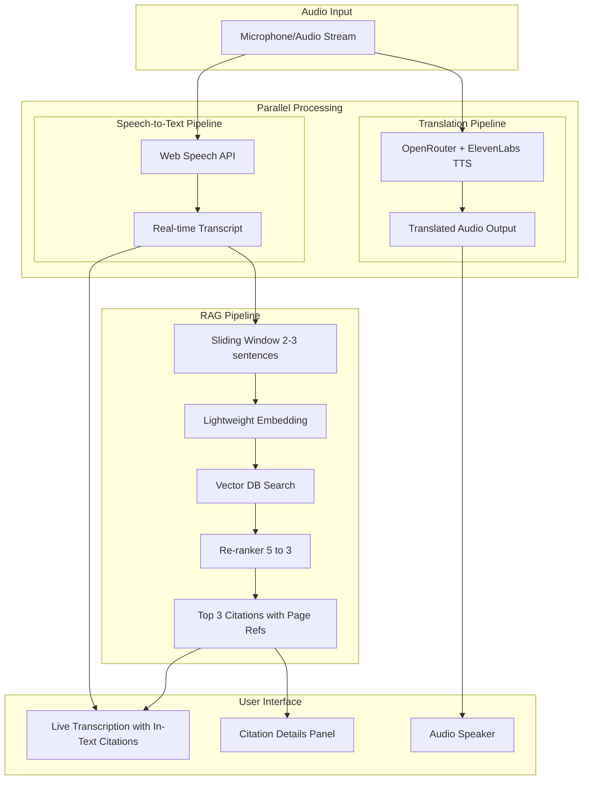
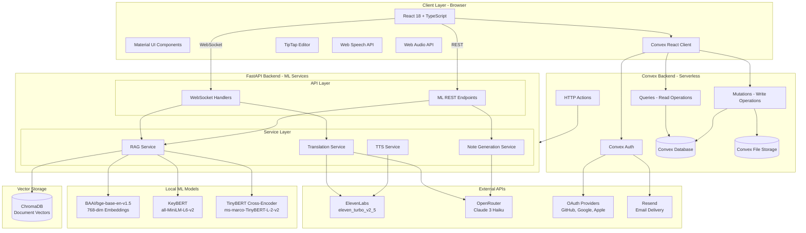
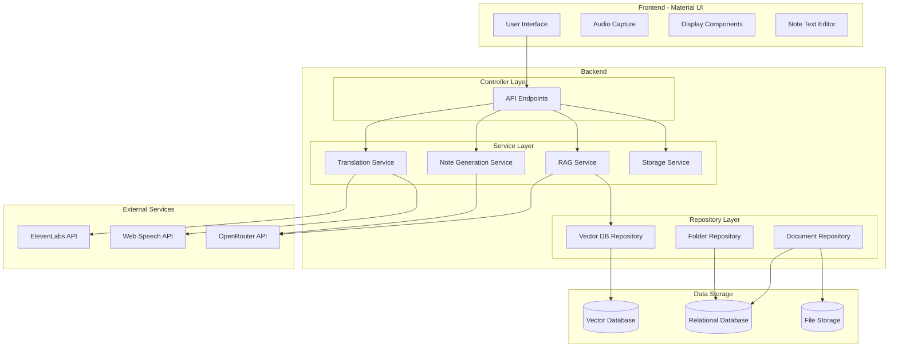

# Product Requirements Document - Rosetta

## Executive Summary

Rosetta is a real-time lecture translation and learning assistant that breaks down language barriers for students in educational settings. The application captures professor speech, translates it in real-time through natural-sounding voice synthesis, and intelligently surfaces relevant course materials as citations alongside the translation.

**Hackathon Context:** HackHive 2026 | Tracks: Best Accessibility Hack + Best Use of ElevenLabs

**Core Value Proposition:** Enable equitable classroom participation regardless of native language through AI-powered real-time translation with contextual learning support.

**Key Capabilities:**

- Real-time text translation via OpenRouter LLM + ElevenLabs Text-to-Speech
- Live transcription display via Web Speech API (browser-native)
- RAG-powered citation retrieval from uploaded course materials (PDFs)
- Folder-based organization for sessions and notes
- Post-lecture structured note generation with embedded citations
- Question translation for classroom participation
- **User authentication** with OAuth (GitHub, Google, Apple) and email/password

**Supported Languages:** English, Hindi, Chinese, French, Spanish, Bengali

---

## Authentication and User Management

### Overview

Rosetta requires user authentication to provide personalized experiences, secure data storage, and multi-device access. The authentication system is built on **Convex Auth**, providing a seamless, serverless authentication experience.

### Authentication Methods

| Method | Description | Implementation |
|--------|-------------|----------------|
| **OAuth - GitHub** | Sign in with GitHub account | Convex Auth + Auth.js GitHub provider |
| **OAuth - Google** | Sign in with Google account | Convex Auth + Auth.js Google provider |
| **OAuth - Apple** | Sign in with Apple ID | Convex Auth + Auth.js Apple provider |
| **Email/Password** | Traditional email and password | Convex Auth Password provider |
| **Email Verification** | OTP code sent to email | Resend API for email delivery |
| **Password Reset** | Reset password via email OTP | Resend API for email delivery |

### User Flows

**Sign Up Flow:**
1. User visits landing page
2. User clicks "Get Started" or "Sign Up"
3. User chooses authentication method:
   - **OAuth**: Redirected to provider, returns authenticated
   - **Email/Password**: Enters email and password, receives verification OTP
4. User completes email verification (for email/password)
5. User redirected to main application

**Sign In Flow:**
1. User visits landing page or is redirected from protected route
2. User clicks "Sign In"
3. User chooses authentication method:
   - **OAuth**: Redirected to provider, returns authenticated
   - **Email/Password**: Enters credentials
4. User redirected to main application

**Password Reset Flow:**
1. User clicks "Forgot your password?"
2. User enters email address
3. System sends OTP to email
4. User enters OTP and new password
5. Password updated, user signed in

### User Data Model

```
Users Table:
- id: Unique identifier (Convex document ID)
- name: Display name (from OAuth or sign-up)
- email: Email address (unique)
- image: Profile picture URL (from OAuth)
- emailVerificationTime: Timestamp when email was verified
- createdAt: Account creation timestamp
```

### Authorization Rules

- All data (folders, sessions, documents, notes) is scoped to the authenticated user
- Users can only access their own data via Convex queries/mutations
- Unauthenticated users see only the landing page
- Protected routes redirect to sign-in

### Session Management

- Sessions managed by Convex Auth
- JWT tokens for secure authentication
- Automatic token refresh
- Sign out available from user menu

---

## Problem Statement

### The Problem

International and ESL students face significant barriers when attending lectures in a language that is not their native tongue. According to UNESCO, over 6 million students study abroad annually, with the majority attending institutions where instruction is delivered in a second language. These students often:

- Miss critical lecture content due to processing delays when mentally translating
- Struggle to connect spoken concepts with course materials written in the instruction language
- Spend excessive time post-lecture trying to reconstruct what was said
- Experience cognitive fatigue from constant translation effort, reducing comprehension and retention
- Hesitate to ask questions in class due to language barriers

### Current Solutions Gap

Existing solutions fail to address the complete problem:

| Solution                     | Limitation                                              |
| ---------------------------- | ------------------------------------------------------- |
| Live human interpreters      | Expensive, not scalable, unavailable for most courses   |
| Post-lecture transcription   | No real-time benefit; students still lost during class  |
| Generic translation apps     | No course context; cannot align with learning materials |
| Recorded lecture translation | Delays learning; no immediate engagement                |

### AI-First Justification

Rosetta requires sophisticated multi-model AI orchestration that goes far beyond basic API calls:

1. **Parallel Speech Processing**: Simultaneous speech-to-text (for transcription/RAG) and text translation with TTS (for audio output)
2. **Real-Time Semantic Understanding**: Sliding window processing of transcript for contextual RAG queries
3. **Optimized RAG Pipeline**: KeyBERT keyword extraction, local BGE embeddings, ChromaDB search, and TinyBERT cross-encoder re-ranking
4. **Citation Alignment**: Matching English course materials to translated output with page references
5. **Intelligent Summarization**: LLM-powered note generation that preserves structure and citations

This multi-stage pipeline creates genuine AI-first value that cannot be replicated with simple API wrappers.

### Impact

- **Educational Equity**: Levels the playing field for non-native speakers
- **Accessibility**: Addresses a real barrier faced by millions of students globally
- **Learning Outcomes**: Improved comprehension and retention through native-language delivery plus contextual materials
- **Cognitive Load Reduction**: Students focus on learning, not translating
- **Classroom Participation**: Question translation enables students to participate actively

---

## Product Description

Rosetta is a web application that transforms the lecture experience for students facing language barriers. The system operates in real-time during live lectures, providing three parallel outputs:

1. **Translated Audio**: Natural-sounding speech in the student's preferred language, delivered through their device speakers or headphones
2. **Live Transcription Display**: Real-time voice-to-text transcription appearing dynamically as the professor speaks, displayed in a visual panel
3. **Contextual Citations**: Relevant course materials automatically surfaced based on what the professor is discussing

After the lecture concludes, students can generate comprehensive, structured notes that combine the full translated transcript with all citations, formatted for effective study and review. Notes are organized within a folder-based system for easy access and management.

### Design Principles

- **Real-Time First**: Every feature prioritizes low latency for live lecture use
- **Context-Aware**: RAG pipeline connects spoken content to uploaded course materials
- **Accessibility-Native**: Multi-sensory output (audio + visual) with screen reader support
- **Privacy-Conscious**: Session data managed with clear retention policies
- **Material Design**: Sleek, modern UI built with Material UI components

---

## User Personas

### Primary Persona: International Graduate Student

**Profile:** Wei, 24, Computer Science Master's Student from China

- Enrolled in English-medium university in North America
- Strong technical skills but struggles with fast-paced English lectures
- Often misses key points while mentally translating technical terms
- Spends 2-3 hours after each lecture reviewing and reconstructing notes

**Needs:**

- Understand lecture content in real-time without cognitive translation burden
- Connect spoken concepts to course readings
- Generate comprehensive notes for later review
- Ask questions in class without language anxiety

**Success Criteria:**

- Can follow along with lecture in Mandarin while professor speaks English
- Relevant textbook pages appear automatically when professor discusses concepts
- Post-lecture notes capture all key points with proper citations
- Can type a question in Mandarin and get an English translation to ask the professor

### Secondary Persona: ESL Undergraduate in STEM

**Profile:** Priya, 20, Biology Major from India

- Fluent in Hindi and conversational English
- Struggles with technical vocabulary and fast-speaking professors
- Visual learner who benefits from seeing text alongside audio
- Wants to improve English while still understanding content

**Needs:**

- Live transcription to follow along visually while listening
- Quick reference to course materials during confusing explanations
- Study notes that help reinforce both subject matter and English vocabulary

**Success Criteria:**

- Sees real-time transcription appearing as professor speaks
- Can click on citations to review relevant course material sections
- Notes include original English terms alongside Hindi explanations

### Tertiary Persona: Accessibility Coordinator

**Profile:** Dr. Martinez, 45, University Disability Services Director

- Responsible for ensuring equitable access for all students
- Evaluating technology solutions for language accessibility
- Concerned about privacy, scalability, and ease of deployment

**Needs:**

- Solution that works across multiple departments and courses
- Clear data handling policies for compliance
- Minimal setup burden for students and faculty

**Success Criteria:**

- Students can self-serve without IT intervention
- System supports multiple language pairs
- Clear documentation on data retention and privacy

---

## Core Technical Pipeline

The system operates through parallel processing pipelines that work simultaneously to minimize latency.

### Pipeline Overview



### Pipeline Timing Targets

| Stage                           | Target Latency                 |
| ------------------------------- | ------------------------------ |
| Speech-to-Text (Web Speech API) | < 300ms                        |
| Text Translation (OpenRouter)   | < 1000ms                       |
| Text-to-Speech (ElevenLabs)     | < 1000ms                       |
| Sliding Window Accumulation     | ~5-10 seconds (2-3 sentences)  |
| Local Embedding Generation      | < 50ms                         |
| Vector Search + Re-ranking      | < 100ms                        |
| Total RAG Pipeline              | ~100ms after window completion |

---

## Product Features

### Feature 1: Real-Time Speech Translation

**Description:** Capture professor speech via browser Web Speech API, translate text via OpenRouter LLM, and output natural-sounding audio through ElevenLabs Text-to-Speech.

**Requirements:**

- Browser-based speech recognition via Web Speech API
- Real-time text translation via OpenRouter (Claude 3 Haiku)
- Natural voice synthesis via ElevenLabs TTS (eleven_turbo_v2_5 model)
- Audio output through device speakers or headphones
- Volume control and mute functionality
- Voice selection from ElevenLabs available voices
- Echo detection to prevent TTS audio from being re-transcribed

**Supported Target Languages:**

- Chinese (Mandarin) - zh
- Hindi - hi
- Spanish - es
- French - fr
- Bengali - bn

**Latency Target:** Less than 2 seconds from speech to translated audio output

### Feature 2: Live Transcription Display

**Description:** Display real-time voice-to-text transcription as the professor speaks, rendered dynamically in a dedicated panel using the browser's Web Speech API, with in-text citations from the RAG pipeline.

**Requirements:**

- Real-time speech-to-text via Web Speech API (browser-native)
- Live transcription appearing word-by-word or phrase-by-phrase as detected
- Dedicated center panel for transcription display
- **In-text citations:** Superscript citation numbers appear inline after relevant segments (e.g., "...fundamental theorem...<sup>1, 2, 3</sup>")
- **Relevance-based styling:** Citations use varying opacity/darkness (darkest = most relevant)
- Clickable citation numbers that highlight corresponding details in the right panel
- Smooth scrolling with auto-scroll to latest content
- Visual indication of active speech detection
- Configurable font size and contrast for accessibility
- Timestamp markers for key segments

**Visual Design:**

- Text appears dynamically as speech is detected, creating a "typing" effect
- Current sentence highlighted or distinguished from previous content
- Citation numbers styled as clickable superscripts with hover effects
- Clean, readable typography optimized for extended reading
- Material UI styling with smooth animations

**Latency Target:** Less than 300ms from speech to text display

### Feature 3: Course Document Management

**Description:** Allow users to upload, view, and manage course materials (PDF documents) that are automatically chunked, embedded, and indexed for RAG retrieval.

**Requirements:**

- Support for PDF file uploads (text-based documents only, no slides)
- Automatic text extraction with page number preservation
- Intelligent chunking with appropriate segment sizes
- Metadata attachment including page number, document name, and section heading
- Progress indicator during processing
- **Full CRUD operations for document management:**
  - **Create**: Upload new PDF documents
  - **Read**: View list of uploaded documents with metadata
  - **Update**: Replace existing documents with new versions
  - **Delete**: Remove documents and their associated embeddings

**Document Management UI (Side Panel):**

- List view of all uploaded documents
- Upload button with drag-and-drop support
- Document cards showing name, page count, and upload date
- Delete button with confirmation dialog
- Processing status indicator (pending, indexing, ready, error)
- Search/filter functionality for documents

**Document Enrichment Process:**

1. Extract text from PDF with page boundaries
2. Chunk into appropriate segments with overlap for context continuity
3. Extract section headings where available
4. Generate embeddings using OpenRouter-accessed embedding models
5. Optionally enrich chunks with summary and key concepts
6. Store with metadata for efficient retrieval

**Supported Document Types:**

- PDF files containing text-based lecture notes, textbook chapters, or reading materials
- Note: Slide decks and image-heavy documents are not supported in this version

### Feature 4: Real-Time RAG Pipeline

**Description:** Continuously analyze professor speech to surface relevant course materials as in-text citations embedded directly within the live transcription.

**Requirements:**

- Sliding window trigger that accumulates 2-3 sentences before initiating RAG query
- KeyBERT keyword extraction for query enrichment
- Local BGE embeddings (BAAI/bge-base-en-v1.5, 768 dimensions)
- Semantic search against ChromaDB document index
- Distance-based early exit (skip re-ranking if min distance > 1.5)
- TinyBERT cross-encoder re-ranking (ms-marco-TinyBERT-L-2-v2)
- **In-text citation display:** Citations appear inline at the end of relevant transcript segments
- Citations ranked best to worst (1 = most relevant, 3 = least relevant)
- Clickable citations to preview document content in sidebar

**Agentic RAG Flow:**

```mermaid
flowchart LR
    subgraph trigger [Trigger Logic]
        TRANSCRIPT[Transcript Buffer]
        DETECT[Sentence Boundary Detection]
        WINDOW[Sliding Window]
        TRANSCRIPT --> DETECT
        DETECT --> WINDOW
    end
    
    subgraph enrich [Query Enrichment]
        KEYWORDS[Keyword Extraction]
        CONCEPTS[Concept Expansion]
        QUERY[Enriched Query]
        WINDOW --> KEYWORDS
        KEYWORDS --> CONCEPTS
        CONCEPTS --> QUERY
    end
    
    subgraph retrieve [Retrieval]
        EMBED[Embed Query]
        SEARCH[Vector Search Top 5]
        RERANK[Cross-Encoder Re-rank]
        TOP3[Top 3 Results]
        QUERY --> EMBED
        EMBED --> SEARCH
        SEARCH --> RERANK
        RERANK --> TOP3
    end
    
    subgraph display [Display]
        CITATIONS[Citation Cards]
        TOP3 --> CITATIONS
    end
```



**Query Enrichment Strategy:**

1. **Keyword Extraction:** Extract key terms and entities from the transcript window
2. **Concept Expansion:** Expand query with related academic concepts
3. **Query Formulation:** Combine original window text with extracted keywords and concepts

**Latency Target:** Less than 500ms from window completion to citation display

### Feature 5: Question Translation Assistant

**Description:** Enable students to type questions in their native language and receive an English translation they can ask the professor, facilitating active classroom participation.

**Requirements:**

- Text input field for typing questions in any supported language
- Real-time translation to English via OpenRouter LLM
- Copy-to-clipboard functionality for the translated question
- Translation history within the session
- Language auto-detection or manual selection

**UI Design:**

- Accessible via a collapsible panel or modal
- Clear input field with placeholder text: "Type your question in your language..."
- Translated output displayed below with copy button
- Visual feedback during translation processing
- Option to speak the translated question (text-to-speech)

**Use Case Flow:**

1. Student has a question but is unsure how to phrase it in English
2. Student opens Question Assistant and types question in native language
3. System translates to grammatically correct English
4. Student copies translation and raises hand to ask, or types in chat

### Feature 6: Post-Lecture Note Generation

**Description:** Generate comprehensive, structured lecture notes from the full translated transcript with embedded citations, with full editing capabilities.

**Requirements:**

- Trigger via "Structure into Notes" button located in the top-left of the text editor interface
- Button can be pressed at any point during or after the lecture
- Compile full translated transcript with all citations
- LLM-powered restructuring into organized format via OpenRouter
- Predefined template with headings, subheadings, and bullet points
- Preserve citation references with page numbers
- **Export as PDF only** (LLM generates structured Markdown, rendered and exported as PDF)
- **Full text editor functionality** when reopening saved notes

**Note Editor Features:**

- Rich text editing capabilities
- "Structure into Notes" button prominently placed in top-left toolbar
- Real-time editing with auto-save
- Markdown preview mode
- PDF export button
- Material UI-styled editor interface

**Note Structure:**

- Key Concepts section with bullet point summary of main topics
- Detailed Notes organized under logical section headings
- Points include citation references in standard format
- Citations Referenced section with ordered list of documents and pages
- Summary paragraph capturing main takeaways

---

## Note Storage and Organization

### Folder-Based Organization System

**Description:** A hierarchical storage system that allows students to organize their lecture sessions, notes, and course materials within folders.

### Folder Structure

```
📁 Course Folder (e.g., "CS 401 - Machine Learning")
├── 📁 Session: Lecture 1 - Introduction (2026-01-20)
│   ├── 📄 Post-Lecture Notes.pdf
│   └── 📄 uploaded_context_chapter1.pdf
├── 📁 Session: Lecture 2 - Linear Regression (2026-01-22)
│   ├── 📄 Post-Lecture Notes.pdf
│   ├── 📄 uploaded_context_chapter2.pdf
│   └── 📄 uploaded_context_slides.pdf
└── 📁 Session: Lecture 3 - Neural Networks (2026-01-24)
    └── 🔴 [In Progress - Session Active]
```

### Folder Management

**Requirements:**

- Create new folders (courses/subjects)
- Rename folders
- Delete folders (with confirmation and cascade delete warning)
- Drag-and-drop organization
- Search across all folders and notes

**Folder Properties:**

- Name
- Created date
- Last modified date
- Number of sessions
- Total storage used

### Session Lifecycle

**Starting a Session:**

1. User navigates to a folder (or creates one)
2. User clicks "Start New Session"
3. User uploads PDF context documents for this session (optional)
4. User begins lecture with translation/transcription active

**During a Session:**

- Real-time transcription and translation active
- Citations from uploaded PDFs appear in sidebar
- Session state saved continuously

**Ending a Session:**

1. User clicks "End Session"
2. System prompts: "Generate structured notes now or save transcript only?"
3. If generating notes: LLM processes transcript into structured format
4. Session saved to folder with:
   - Post-lecture notes (editable, exportable as PDF)
   - All PDF documents uploaded for that session
   - Session metadata (date, duration, languages used)

### Stored Content Per Session

| Content Type          | Description                    | Editable          | Exportable         |
| --------------------- | ------------------------------ | ----------------- | ------------------ |
| Post-Lecture Notes    | LLM-generated structured notes | Yes (text editor) | PDF only           |
| PDF Context Documents | Uploaded course materials      | No (read-only)    | N/A (already PDFs) |
| Session Metadata      | Date, duration, languages      | No                | Included in notes  |

### Notes Retrieval and Editing

**Reopening Notes:**

1. Navigate to folder → session
2. Click on "Post-Lecture Notes"
3. Notes open in full text editor view
4. Edit freely with all formatting options
5. Changes auto-saved
6. Export to PDF when ready

**Editor Toolbar (Top):**

- **Left Side:** "Structure into Notes" button (re-generate from transcript)
- **Center:** Formatting options (bold, italic, headers, lists)
- **Right Side:** Export to PDF button

### Data Model for Storage

**Folders Table:**

- `id`: Unique identifier
- `name`: Folder name
- `user_id`: Owner
- `created_at`: Timestamp
- `updated_at`: Timestamp

**Sessions Table:**

- `id`: Unique identifier
- `folder_id`: Parent folder reference
- `name`: Session name/title
- `source_language`: Original lecture language
- `target_language`: Translation language
- `started_at`: Session start time
- `ended_at`: Session end time
- `status`: (active, completed, archived)

**Notes Table:**

- `id`: Unique identifier
- `session_id`: Parent session reference
- `content_markdown`: Structured notes in Markdown
- `generated_at`: When notes were generated
- `last_edited_at`: Last edit timestamp
- `version`: Version number for edit history

**Session Documents Table:**

- `id`: Unique identifier
- `session_id`: Parent session reference
- `document_id`: Reference to uploaded document
- `uploaded_at`: When added to session

---

## Technical Architecture

### Hybrid Architecture Overview

Rosetta uses a **hybrid architecture** combining Convex (serverless backend) for data operations with FastAPI for ML/AI services:

- **Convex**: Authentication, database (CRUD), real-time subscriptions, file storage
- **FastAPI**: ML models, RAG pipeline, translation streaming, TTS integration

This separation allows us to leverage Convex's real-time capabilities and seamless React integration while maintaining FastAPI's strength in ML model hosting and streaming audio.

### Full-Stack System Design



### Layer Responsibilities

**Client Layer:**
- React handles UI rendering and user interactions
- Material UI provides accessible, styled components
- Convex React Client provides real-time subscriptions and optimistic updates
- Web Speech API captures and transcribes audio
- TipTap provides rich text editing for notes

**Convex Backend (Serverless):**
- **Authentication**: OAuth (GitHub, Google, Apple) and email/password via Convex Auth
- **Database**: Stores folders, sessions, documents metadata, transcripts, citations, notes
- **Real-time**: Automatic subscriptions for live data updates across clients
- **File Storage**: PDF document storage with secure URLs
- **HTTP Actions**: Bridge to FastAPI for ML processing

**FastAPI Backend (ML Services):**
- WebSocket handlers for real-time transcription and translation streams
- RAG pipeline with local ML models for semantic search
- Note generation via LLM
- TTS integration with ElevenLabs

**Local ML Models:**
- BGE embeddings run locally for document indexing and query embedding
- KeyBERT extracts keywords for query enrichment
- TinyBERT re-ranks citation candidates

**External APIs:**
- ElevenLabs provides natural-sounding TTS for translation and question speaking
- OpenRouter provides LLM access for translation and note generation
- OAuth providers (GitHub, Google, Apple) for authentication
- Resend for email delivery (verification OTPs, password reset)

**Data Layer:**
- **Convex Database**: Stores all structured data (folders, sessions, transcripts, citations, notes)
- **Convex File Storage**: Stores uploaded PDF documents with secure access
- **ChromaDB**: Stores vector embeddings for semantic search (managed by FastAPI)

### System Architecture Overview



### Technology Stack

| Component               | Technology             | Purpose                                  |
| ----------------------- | ---------------------- | ---------------------------------------- |
| Frontend                | React + TypeScript     | User interface, real-time display        |
| UI Framework            | Material UI (MUI)      | Modern component library                 |
| **Serverless Backend**  | **Convex**             | **Database, auth, file storage, real-time** |
| **Authentication**      | **Convex Auth**        | **OAuth + email/password authentication** |
| ML Backend              | FastAPI + Python       | ML services, RAG pipeline, streaming     |
| Validation              | Pydantic               | Request/response schema validation       |
| Vector Database         | ChromaDB               | Document embedding storage               |
| **Database**            | **Convex Database**    | **Sessions, folders, notes, metadata**   |
| **File Storage**        | **Convex File Storage**| **PDF document storage**                 |
| Text-to-Speech          | ElevenLabs API         | eleven_turbo_v2_5 model                  |
| Speech-to-Text          | Web Speech API         | Browser-native transcription             |
| Embeddings              | Local BGE model        | BAAI/bge-base-en-v1.5 (768 dim)          |
| LLM                     | OpenRouter API         | Translation, notes, question translation |
| Re-ranking              | TinyBERT Cross-Encoder | ms-marco-TinyBERT-L-2-v2                 |
| Keywords                | KeyBERT                | Query enrichment                         |
| Real-time Communication | WebSocket + Convex     | ML streaming + data subscriptions        |
| Text Editor             | TipTap                 | Rich text editing for notes              |
| **Email Delivery**      | **Resend**             | **OTP emails for verification/reset**    |

### Backend Architecture Pattern

The backend follows the Controller-Service-Repository pattern with dependency injection for clean separation of concerns and testability.

**Controller Layer:** Handles API endpoint definitions and request/response handling. Routes requests to appropriate services.

**Service Layer:** Contains business logic and orchestration. Coordinates between external APIs and repositories.

**Repository Layer:** Abstracts data access. Provides clean interface for vector database, relational database, and file storage operations.

**Data Transfer Objects (DTOs):** All API contracts use Pydantic models for validation and documentation.

### API Endpoints Overview

**Convex Functions (Real-time Database Operations):**

| Function                        | Type     | Purpose                         |
| ------------------------------- | -------- | ------------------------------- |
| **Folder Management**           |          |                                 |
| `folders.list`                  | Query    | List user's folders             |
| `folders.create`                | Mutation | Create new folder               |
| `folders.update`                | Mutation | Update folder                   |
| `folders.remove`                | Mutation | Delete folder                   |
| **Session Management**          |          |                                 |
| `sessions.listByFolder`         | Query    | List sessions in folder         |
| `sessions.get`                  | Query    | Get session details             |
| `sessions.create`               | Mutation | Start new session               |
| `sessions.update`               | Mutation | Update session                  |
| `sessions.end`                  | Mutation | End session                     |
| **Document Management**         |          |                                 |
| `documents.listBySession`       | Query    | List documents in session       |
| `documents.generateUploadUrl`   | Mutation | Get signed upload URL           |
| `documents.saveDocument`        | Mutation | Save document metadata          |
| `documents.remove`              | Mutation | Delete document                 |
| **Notes**                       |          |                                 |
| `notes.getBySession`            | Query    | Get session notes               |
| `notes.update`                  | Mutation | Update session notes            |

**FastAPI Endpoints (ML Services):**

| Endpoint                        | Method    | Purpose                         |
| ------------------------------- | --------- | ------------------------------- |
| **Translation & Transcription** |           |                                 |
| `/api/v1/translate/stream`      | WebSocket | Stream audio for translation    |
| `/api/v1/transcribe/stream`     | WebSocket | Stream audio for speech-to-text |
| `/api/v1/translate/question`    | POST      | Translate question text         |
| `/api/v1/translate/tts/speak`   | POST      | Text-to-speech synthesis        |
| **RAG & Citations**             |           |                                 |
| `/api/v1/rag/query`             | POST      | Query for citations             |
| `/api/v1/documents/process`     | POST      | Process document for embeddings |
| **Notes**                       |           |                                 |
| `/api/v1/sessions/{id}/notes/generate` | POST | Generate structured notes  |
| `/api/v1/sessions/{id}/notes/export`   | GET  | Export notes as PDF        |

### Data Model Overview (Convex Schema)

All data is stored in Convex with user-scoped access control:

**users:** User accounts with OAuth/email auth (managed by Convex Auth)
- `_id`, `name`, `email`, `image`, `emailVerificationTime`

**folders:** Course/subject organization
- `userId` (reference to users), `name`, `archivedAt`, `_creationTime`

**sessions:** Lecture session information
- `folderId` (reference to folders), `userId`, `name`, `status` (active/completed/archived)
- `sourceLanguage`, `targetLanguage`, `startedAt`, `endedAt`

**documents:** Uploaded course materials
- `sessionId` (reference to sessions), `userId`, `name`, `storageId` (Convex file reference)
- `fileSize`, `pageCount`, `chunkCount`, `status` (pending/processing/ready/error), `processingProgress`

**transcripts:** Original and translated text segments
- `sessionId`, `originalText`, `translatedText`, `timestamp`, `windowIndex`

**citations:** Retrieved citations from RAG
- `sessionId`, `transcriptId`, `documentId`, `pageNumber`, `relevanceScore`, `chunkText`

**notes:** Generated lecture notes
- `sessionId`, `contentMarkdown`, `generatedAt`, `lastEditedAt`, `version`

---

## Technical Recommendations

Based on research into available tools and hackathon constraints:

| Component       | Implementation                | Rationale                                    |
| --------------- | ----------------------------- | -------------------------------------------- |
| Vector DB       | ChromaDB                      | Python-native, lightweight, easy local setup |
| LLM Access      | OpenRouter                    | Single API for Claude, GPT-4o-mini           |
| Embeddings      | BAAI/bge-base-en-v1.5 (local) | 768 dimensions, fast local inference (~50ms) |
| Keywords        | KeyBERT + MiniLM              | sentence-transformers/all-MiniLM-L6-v2       |
| Re-ranker       | TinyBERT Cross-encoder        | ms-marco-TinyBERT-L-2-v2 (~12ms)             |
| Translation     | Claude 3 Haiku                | Fast inference, good quality                 |
| Note Generation | Claude 3 Haiku                | Excellent structured formatting              |
| TTS             | ElevenLabs eleven_turbo_v2_5  | Low latency, natural voice                   |
| UI Framework    | Material UI v5                | Modern, accessible components                |
| Text Editor     | TipTap                        | Headless, Markdown support                   |

### OpenRouter Integration

**Benefits:**

- Single API key for multiple model providers
- Automatic fallback if a model is unavailable
- Cost tracking and rate limiting built-in
- Access to latest models without code changes

**Model Selection Strategy:**

- Use faster, cheaper models for real-time operations (embeddings, query enrichment)
- Use higher-quality models for note generation (better structure and coherence)
- Configure fallback chains for reliability

### Embedding Storage Strategy

**For Course Documents (Persistent):**

- Stored in dedicated collection
- Includes metadata for document ID, page number, heading, and user ID
- Persists across sessions

**For Session Transcripts (Ephemeral):**

- Stored in separate collection with session tagging
- Includes metadata for session ID, timestamp, and window index
- Automatically cleaned up when session ends

---

## User Interface Design

### Design Philosophy

The interface follows Material Design principles with a modern, accessible aesthetic. The UI prioritizes clarity and usability during live lecture scenarios, with a responsive layout that adapts to different screen sizes. The design emphasizes high contrast for accessibility and provides a clean workspace that minimizes cognitive load while maximizing information density.

### Main Application View

The primary interface uses a three-panel layout to support simultaneous consumption of multiple information streams:

**Left Panel - Navigation and Content Management:**
Contains folder-based organization for courses and sessions, along with document management capabilities. Users can browse their session history, create new folders, and manage uploaded course materials.

**Center Panel - Live Transcription with In-Text Citations:**
The largest area of the screen displays real-time transcription of the professor's speech. Text appears dynamically as speech is detected, with automatic scrolling to keep the latest content visible. Citations appear inline as superscript numbers (e.g., "...fundamental theorem of calculus...<sup>1, 2, 3</sup>") with relevance-based styling where more relevant citations appear darker. Timestamp markers help orient students within the lecture timeline. The question translation assistant is accessible from this panel.

**Right Panel - Citation Details:**
Displays detailed information about the in-text citations. When users hover over or click citation numbers in the transcription, this panel shows the corresponding document names, page references, and content previews. Users can click through to view full document content.

**Bottom Control Bar:**
Provides session controls including recording status, playback controls, volume adjustment, and quick access to note generation.

### Note Editor View

The note editing interface provides a full-featured text editing workspace. A toolbar offers formatting options and includes the "Structure into Notes" button for LLM-powered note generation. The editor supports rich text editing with Markdown, with an export option to generate PDF versions of completed notes.

---

## Success Metrics

### Core Performance Metrics

| Metric                | Target                 | Measurement Method                           |
| --------------------- | ---------------------- | -------------------------------------------- |
| Translation Latency   | < 2 seconds            | Time from speech end to audio output start   |
| Transcription Latency | < 300ms                | Time from speech to text display             |
| RAG Query Latency     | < 500ms                | Time from window trigger to citation display |
| Translation Quality   | User satisfaction 4+/5 | Post-session rating                          |
| Citation Relevance    | 80%+ precision         | User feedback on displayed citations         |
| Note Quality          | Captures 90%+ concepts | Comparison with manual notes                 |

### Hackathon Demo Metrics

| Metric              | Target                                                |
| ------------------- | ----------------------------------------------------- |
| Supported Languages | 6 (English, Hindi, Chinese, French, Spanish, Bengali) |
| Document Types      | PDF (text-based)                                      |
| Concurrent Users    | 1 (demo mode)                                         |
| Session Duration    | Up to 2 hours                                         |
| Document Size       | Up to 100 pages                                       |

### User Experience Metrics

| Metric                    | Target                                                               |
| ------------------------- | -------------------------------------------------------------------- |
| Time to First Translation | < 5 seconds after session start                                      |
| Time to First Citation    | < 15 seconds after relevant content spoken                           |
| Note Generation Time      | < 30 seconds for 1-hour lecture                                      |
| Setup Time                | < 2 minutes (folder creation + document upload + language selection) |
| Question Translation      | < 2 seconds                                                          |

---

## Responsibility and Ethics

### Data Privacy

- **Audio Data**: Streamed directly to external APIs; not stored on our servers
- **Transcripts**: Stored for session duration only; deleted on session end (configurable)
- **Course Documents**: Stored in user's isolated namespace; user can delete at any time
- **Session Embeddings**: Ephemeral; automatically cleaned up after session
- **Notes**: Stored persistently until user deletes; user has full control

### Transparency

- **Translation Confidence**: Display confidence indicators when translation quality may be uncertain
- **Citation Relevance**: Show relevance scores so users understand why documents were surfaced
- **AI Limitations**: Clear disclosure that translations may not capture nuance; recommend verification for critical content

### Accessibility

- **Multi-Sensory Output**: Audio translation plus visual transcription plus written citations
- **Screen Reader Support**: ARIA labels and semantic HTML throughout
- **Keyboard Navigation**: Full functionality without mouse
- **High Contrast Mode**: User-configurable display settings
- **Font Scaling**: Adjustable transcription and citation text size
- **Material UI Accessibility**: Built-in a11y compliance from component library

### Bias Mitigation

- **Accent Testing**: Validate translation quality across diverse speaker accents
- **Language Pair Quality**: Acknowledge varying quality across language pairs
- **Feedback Mechanism**: Allow users to flag translation errors for improvement

### Responsible AI Practices

- **Human Oversight**: Users can pause, review, and correct translations
- **No Permanent Recording**: Audio is processed in real-time, not recorded
- **Consent**: Clear user consent before microphone activation
- **Rate Limiting**: Prevent abuse of external APIs

---

## Hackathon Track Alignment

### Best Accessibility Hack

Rosetta directly addresses accessibility by removing language barriers that prevent millions of students from fully participating in education.

| Criterion              | How Rosetta Addresses It                                                    |
| ---------------------- | --------------------------------------------------------------------------- |
| Real Problem           | 6M+ international students struggle with language barriers in lectures      |
| Underrepresented Users | ESL students, immigrants, students from non-English speaking countries      |
| Multi-Sensory          | Audio translation plus visual transcription plus written citations          |
| Inclusive Design       | Screen reader support, keyboard navigation, high contrast, Material UI a11y |
| Measurable Impact      | Improved comprehension, reduced cognitive load, better retention            |

**Accessibility Features:**

1. Real-time audio translation eliminates need for mental translation
2. Live transcription display provides visual reinforcement
3. Citation sidebar provides contextual reference to concepts
4. Question translation enables classroom participation
5. Structured notes enable effective review without replay
6. Configurable display settings for visual accessibility

### Best Use of ElevenLabs

Rosetta showcases ElevenLabs as the core enabler of the translation experience.

| Criterion             | How Rosetta Uses ElevenLabs                                          |
| --------------------- | -------------------------------------------------------------------- |
| Central to Product    | Text-to-Speech API is the primary voice synthesis engine             |
| Real-Time Streaming   | Audio output during live lectures                                    |
| Natural Voice Quality | Human-like synthesis via eleven_turbo_v2_5 model                     |
| Multi-Language        | Supports voice selection for different languages                     |
| User Value            | Natural-sounding translation enables comfortable listening for hours |

**ElevenLabs Integration Highlights:**

1. Primary translation pipeline, not just a supplementary feature
2. WebSocket streaming for minimal latency
3. Voice quality that does not cause listener fatigue
4. Language selection integrated into user preferences

---

## Code Integrity and Engineering Quality (Bonus Criteria)

### Architecture Patterns

- **Controller-Service-Repository**: Clean separation of concerns across layers
- **Dependency Injection**: All services injected for testability and flexibility
- **DTO Pattern**: Pydantic models for all API contracts
- **Repository Abstraction**: Data access isolated from business logic

### Code Quality Practices

- **Type Hints**: Full Python type annotations throughout
- **Validation**: Request/response validation with clear error messages
- **Async Processing**: Non-blocking I/O for all external API calls
- **Error Handling**: Consistent error responses with appropriate status codes

### Scalability Considerations

- **Stateless Services**: No server-side session state; all state in database
- **Horizontal Scaling**: Services can be replicated behind load balancer
- **Background Tasks**: Long-running operations run asynchronously
- **Caching Strategy**: Frequently accessed embeddings cached in memory

### Testing Strategy

- **Unit Tests**: Service layer logic with mocked dependencies
- **Integration Tests**: API endpoints with test database
- **End-to-End Tests**: Critical user flows automated

---

## Appendix

### A. Supported Languages

| Language           | Code | ElevenLabs Support | Web Speech API Support |
| ------------------ | ---- | ------------------ | ---------------------- |
| English            | en   | Yes                | Yes                    |
| Hindi              | hi   | Yes                | Yes                    |
| Chinese (Mandarin) | zh   | Yes                | Yes                    |
| French             | fr   | Yes                | Yes                    |
| Spanish            | es   | Yes                | Yes                    |
| Bengali            | bn   | Yes                | Yes                    |

### B. Glossary

| Term           | Definition                                                                                 |
| -------------- | ------------------------------------------------------------------------------------------ |
| RAG            | Retrieval-Augmented Generation - technique to enhance LLM responses with retrieved context |
| STT            | Speech-to-Text - converting spoken audio to written text                                   |
| TTS            | Text-to-Speech - converting written text to spoken audio                                   |
| Embedding      | Vector representation of text for semantic similarity comparison                           |
| Re-ranking     | Process of reordering search results using a more sophisticated model                      |
| Sliding Window | Technique of processing text in overlapping segments                                       |
| Cross-encoder  | Model that scores relevance between query and document pairs                               |
| OpenRouter     | API aggregator providing unified access to multiple LLM providers                          |
| Material UI    | React component library implementing Google's Material Design                              |

### C. Dependencies

**External APIs:**

- ElevenLabs Text-to-Speech API
- Web Speech API (browser-native)
- OpenRouter API (for LLM access)
- **Convex** (serverless backend platform)
- **Resend** (email delivery for OTPs)
- **OAuth Providers** (GitHub, Google, Apple)

**Key Libraries:**

- **Convex** (real-time database, auth, file storage)
- **@convex-dev/auth** (authentication library)
- Chroma (vector database)
- Sentence Transformers (re-ranking)
- FastAPI (ML backend framework)
- Pydantic (validation)
- React (frontend framework)
- Material UI / MUI (component library)
- TipTap (text editor)
- react-pdf / pdfmake (PDF export)

### D. Future Considerations

- Support for additional language pairs
- Speaker diarization for multi-speaker lectures
- Integration with learning management systems
- Mobile application
- Offline mode with local models
- Collaborative note-taking features
- Slide/image support in documents
- Voice input for question translation

---

## Document History

| Version | Date       | Author           | Changes                                                                                                                                                                                                                                                                                    |
| ------- | ---------- | ---------------- | ------------------------------------------------------------------------------------------------------------------------------------------------------------------------------------------------------------------------------------------------------------------------------------------ |
| 1.0     | 2026-01-24 | Rosetta Team | Initial PRD for HackHive 2026                                                                                                                                                                                                                                                              |
| 1.1     | 2026-01-24 | Rosetta Team | Major updates: Replaced subtitles with live transcription display, added folder/session-based note storage, added question translation feature, switched to OpenRouter for LLM access, added CRUD operations for documents, updated to Material UI, PDF-only export, text editor for notes |
| 1.2     | 2026-01-25 | Rosetta Team | Renamed product to Rosetta, updated RAG pipeline to use local models (BGE embeddings, KeyBERT, TinyBERT), reduced re-ranking candidates from 10 to 5, added distance-based early exit |
| 2.0     | 2026-01-31 | Rosetta Team | **Major architecture update**: Migrated to hybrid Convex + FastAPI architecture. Added user authentication (OAuth: GitHub, Google, Apple + email/password with verification). Replaced PostgreSQL with Convex Database, local file storage with Convex File Storage. Added landing page for unauthenticated users. |
